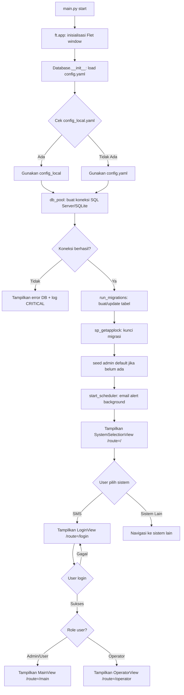
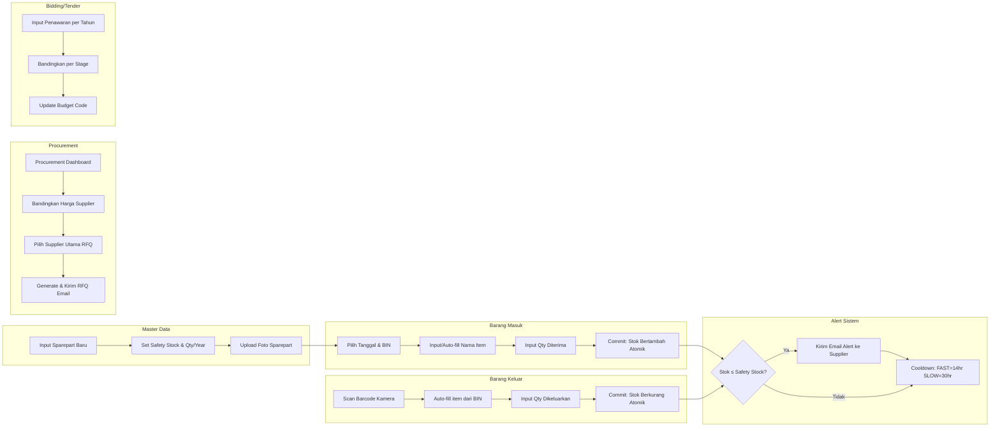
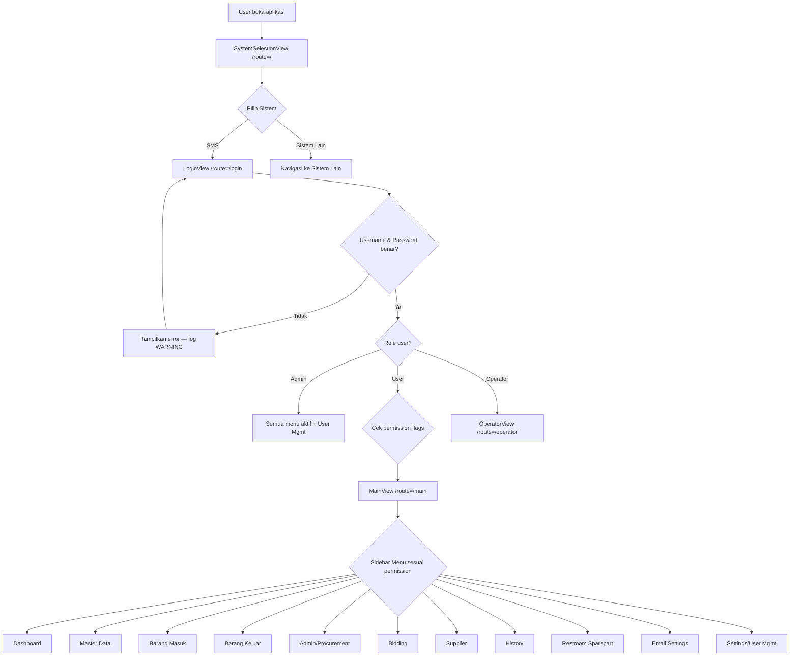
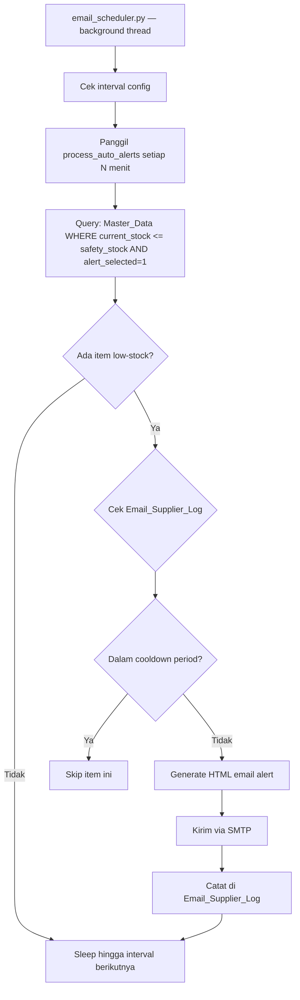

# SMS — System Management Sparepart (UPMS) — Dokumentasi Lengkap

> **Versi Dokumen**: 1.9.0 | **Versi Aplikasi**: 4.27.0 | **Terakhir Diperbarui**: 22 Juli 2026  
> **Dibuat untuk**: Tim IT & Developer UP Management PT PPI

---

## Daftar Isi

1. [Gambaran Umum Sistem](#1-gambaran-umum-sistem)
2. [Teknologi & Dependencies](#2-teknologi--dependencies)
3. [Struktur Folder Lengkap](#3-struktur-folder-lengkap)
4. [Arsitektur Sistem](#4-arsitektur-sistem)
5. [Entity Relationship Diagram (ERD)](#5-entity-relationship-diagram-erd)
6. [Alur Sistem (System Flow)](#6-alur-sistem-system-flow)
7. [Role & Permission Matrix](#7-role--permission-matrix)
8. [Penjelasan Setiap Module](#8-penjelasan-setiap-module)
9. [Alur Data Multi-User](#9-alur-data-multi-user)
10. [Konfigurasi Database](#10-konfigurasi-database)
11. [Panduan Deployment & Build](#11-panduan-deployment--build)
12. [Panduan Troubleshooting](#12-panduan-troubleshooting)

---

## 1. Gambaran Umum Sistem

**SMS (System Management Sparepart)**, yang juga dikenal sebagai **UPMS (UP-Management Sparepart)**, adalah sistem manajemen sparepart berbasis desktop yang dirancang untuk menggantikan proses pencatatan dan pengelolaan sparepart manual/kertas di lingkungan produksi PT PPI.

### Tujuan Sistem

- Digitalisasi seluruh proses pengelolaan sparepart produksi (barang masuk, barang keluar, master katalog)
- Memungkinkan hingga **100 pengguna bersamaan** (concurrent) berbagi satu database SQL Server terpusat
- Menyimpan semua data terpusat di **SQL Server** agar tidak ada data yang terlewat antar user
- Menyediakan **kontrol akses berbasis role** (RBAC) agar tiap bagian/divisi hanya bisa mengakses menu yang relevan
- Mengelola proses **bidding/tender** pengadaan sparepart bersama supplier
- Mengirim **email alert otomatis** ketika stok sparepart mencapai batas minimum (*safety stock*)
- Menghasilkan laporan KPI dan analitik inventori melalui **Dashboard**

### Konsep Dasar: Apa itu SMS/UPMS?

SMS adalah sistem pengelolaan sparepart yang mencakup seluruh siklus hidup sebuah item sparepart, dari data master, pergerakan stok, hingga proses pengadaan/procurement:

| Modul | Nama | Fungsi |
|-------|------|--------|
| Master Data | Katalog Sparepart | Data induk semua sparepart: nama, mesin, BIN, stok, dll |
| Barang Masuk | Incoming Goods | Pencatatan sparepart yang masuk ke gudang |
| Barang Keluar | Outgoing Goods | Pencatatan sparepart yang dikeluarkan (dengan barcode scan) |
| Admin Management | Procurement Dashboard | Perbandingan harga supplier, manajemen RFQ |
| Bidding | Tender Management | Pengelolaan tender/bidding sparepart per tahun |
| Supplier | Master Supplier | Data master vendor/pemasok sparepart |
| Dashboard | KPI & Insights | Ringkasan inventori, grafik, analitik real-time |
| History | Riwayat Transaksi | Log semua pergerakan barang masuk & keluar |
| Restroom Sparepart | Asset Sparepart | Manajemen sparepart fasilitas/restroom |
| Email Settings | Konfigurasi Email | Pengaturan SMTP, alert otomatis, dan pengiriman RFQ |
| Settings | User Management | Manajemen user dan hak akses |
| Operator View | Antarmuka Teknisi | Tampilan sederhana khusus teknisi untuk Barang Keluar |

---

## 2. Teknologi & Dependencies

```
Bahasa      : Python 3.13
GUI         : Flet 0.21.2 (Flutter-based Desktop UI Framework)
Database    : Microsoft SQL Server (ODBC Driver 17/18) — production
              SQLite — fallback/development
DB Driver   : pyodbc 5.0+ (koneksi SQL Server via ODBC)
Auth        : bcrypt 4.1.2 (password hashing)
Barcode     : OpenCV (cv2.VideoCapture) + pyzbar (QR/Barcode decoder)
Excel Export: openpyxl 3.1.5+
Build System: PyInstaller 6.20.0
Packaging   : deploy.bat → UPMS v.4.26.2.exe
Email       : SMTP/IMAP (stdlib smtplib + imaplib)
Analytics   : pandas 2.0+ (data processing)
```

### Install Dependencies

```bash
pip install -r requirements.txt
```

### Isi `requirements.txt`

```
flet==0.21.2
bcrypt==4.1.2
numpy>=1.24.0
openpyxl>=3.1.5
pandas>=2.0.0
pillow>=10.0.0
pyodbc>=5.0.0
python-barcode>=0.15.0
PyYAML==6.0.1
sqlalchemy>=2.0.0
opencv-python-headless>=4.8.0
pyzbar>=0.1.9
```

---

## 3. Struktur Folder Lengkap

```
UP-Management Sparepart-python/
│
├── main.py                         # Entry point — start aplikasi di sini
├── database.py                     # ~2007 baris — SEMUA logika DB: CRUD, migrasi, auth
├── config.yaml                     # KONFIGURASI PRODUCTION — edit untuk setup server
├── config_local.yaml               # KONFIGURASI LOCAL DEV — SQLite / MySQL fallback
├── styles.py                       # ColorPalette & AppStyles (global tema visual)
├── UPMS_App.spec                   # Konfigurasi build PyInstaller
├── deploy.bat                      # Script otomasi build & packaging EXE
├── requirements.txt                # Daftar semua library Python yang dibutuhkan
├── knowledge.md                    # Knowledge base internal sistem
├── DOCS-SMS.md                     # File ini — dokumentasi lengkap SMS
│
├── assets/                         # Asset visual aplikasi
│   ├── app_icon.ico                # Ikon EXE file (Windows taskbar/explorer)
│   ├── app_icon.png                # Ikon jendela aplikasi (runtime Flet)
│   ├── logo_upms_new.png           # Logo utama aplikasi
│   ├── ERD-NEW.png                 # Diagram ERD terkini
│   ├── WORKFLOW SYSTEM.png         # Diagram alur workflow sistem
│   └── sparepart_image/            # Foto sparepart (dikelompokkan per folder BIN)
│
├── logs/                           # Log file (dibuat otomatis saat runtime)
│   └── upms_YYYY-MM-DD.log         # Log harian dengan rotasi 7 hari
│
├── data/                           # Data statis & referensi import
│   ├── MasterData.csv              # Seed data master sparepart (import awal)
│   ├── Book2.csv                   # Data referensi tambahan
│   ├── Book2.xlsx                  # Versi Excel data referensi
│   ├── sparepart_bidding_new_cleaned.csv  # Data bidding historis
│   └── supplier.csv                # Data master supplier awal
│
├── barcodes/                       # Output file barcode yang digenerate
│
├── deploy/                         # Output hasil build (setelah jalankan deploy.bat)
│   ├── UPMS v.4.26.2.exe           # EXE final yang didistribusikan ke user
│   ├── config.yaml                 # Config production yang disertakan
│   ├── _internal/                  # Dependensi PyInstaller (~2000 file)
│   ├── data/                       # Salinan folder data
│   └── logs/                       # Folder log kosong awal
│
├── views/                          # Semua komponen antarmuka (17 views)
│   ├── __init__.py
│   ├── system_selection_view.py    # Halaman pemilihan sistem (portal awal)
│   ├── login_view.py               # Halaman login dengan branding sidebar
│   ├── main_view.py                # Shell utama: sidebar, header, RBAC routing
│   ├── dashboard_view.py           # Dashboard KPI & grafik analitik inventori
│   ├── master_data_view.py         # CRUD katalog sparepart (master data)
│   ├── master_data_page.py         # Halaman master data alternatif (paginasi)
│   ├── line_mapping_view.py        # Pemetaan jalur produksi kompatibel per sparepart
│   ├── barang_masuk_view.py        # Pencatatan barang masuk + auto-fill
│   ├── barang_keluar_view.py       # Barang keluar + kamera barcode scanner
│   ├── admin_management_view.py    # Procurement dashboard + perbandingan supplier
│   ├── bidding_view.py             # Manajemen tender/bidding tahunan
│   ├── supplier_view.py            # CRUD master supplier
│   ├── history_view.py             # Riwayat transaksi dual-tab (masuk/keluar)
│   ├── restroom_sparepart_view.py  # Manajemen asset sparepart fasilitas
│   ├── email_settings_view.py      # Konfigurasi SMTP, alert, RFQ email
│   ├── settings_view.py            # User management + permission RBAC
│   └── operator_view.py            # Antarmuka sederhana untuk teknisi/operator
│
├── utils/                          # Modul utilitas (5 modul)
│   ├── db_pool.py                  # Thread-local connection pool dengan retry
│   ├── logger.py                   # Logger thread-safe (rotasi harian)
│   ├── paths.py                    # Resolusi path: EXE mode vs script mode
│   ├── email_service.py            # Layanan SMTP/IMAP: report, RFQ, Gmail draft
│   └── email_scheduler.py         # Scheduler background untuk alert email otomatis
│
├── scripts/                        # 18+ skrip utilitas & migrasi
│   ├── generate_version.py         # Generate info versi untuk PyInstaller
│   ├── infra_upgrade.py            # SEQUENCE, Audit_Log, soft-delete migration
│   ├── fix_restroom_schema.py      # Perbaikan skema tabel restroom
│   ├── fix_supplier_mapping.py     # Perbaikan mapping supplier
│   ├── migrate_suppliers.py        # Migrasi data supplier
│   ├── import_bidding_history.py   # Import histori bidding dari CSV
│   ├── import_sparepart_asset.py   # Import data asset sparepart
│   ├── diagnose_db.py              # Diagnostik koneksi dan skema DB
│   ├── check_columns.py            # Cek ketersediaan kolom di tabel DB
│   └── ... (skrip lainnya)
│
├── migrations/                     # File migrasi database versi
│
└── testsprite_tests/               # Script dan rencana pengujian
    ├── test_data_layer.py              # Unit test layer data
    ├── testsprite_backend_test_plan.json   # Rencana uji backend
    ├── testsprite_frontend_test_plan.json  # Rencana uji frontend
    └── standard_prd.json               # PRD standar untuk referensi QA
```

---

## 4. Arsitektur Sistem

### Layer Architecture

```
┌─────────────────────────────────────────────────────────┐
│                   PRESENTATION LAYER                     │
│  Flet (Flutter-based) Views — views/                    │
│  login_view.py │ main_view.py │ dashboard_view.py │ ... │
└──────────────────────────┬──────────────────────────────┘
                           │ calls
┌──────────────────────────▼──────────────────────────────┐
│                  APPLICATION LAYER                       │
│  Business Logic + Data Coordination                     │
│  database.py (CRUD) │ utils/email_service.py            │
│  utils/email_scheduler.py │ utils/db_pool.py            │
└──────────────────────────┬──────────────────────────────┘
                           │ uses
┌──────────────────────────▼──────────────────────────────┐
│                    DATA LAYER                           │
│  Microsoft SQL Server (production)                      │
│  SQLite (development/fallback)                          │
│  utils/db_pool.py → thread-local connection pool        │
│  config.yaml │ utils/logger.py                          │
└─────────────────────────────────────────────────────────┘
```

### Runtime Model

```
┌────────────────────────────────────────────────────────┐
│                  100 PC (Client)                       │
│  PC 1: UPMS v.4.26.2.exe  ─────────────────────┐      │
│  PC 2: UPMS v.4.26.2.exe  ─────────────────┐   │      │
│  PC 3: UPMS v.4.26.2.exe  ─────────────┐   │   │      │
│  ...                                    │   │   │      │
└─────────────────────────────────────────┼───┼───┘      │
                                          ▼   ▼   ▼       
                              ┌─────────────────────┐     
                              │  SQL Server (Server)│     
                              │  UPMS_Database      │     
                              │  Port: 1433         │     
                              └─────────────────────┘     
```

- Setiap PC menjalankan **EXE lokal** masing-masing — bukan web server
- Semua EXE terhubung ke satu **SQL Server bersama** melalui ODBC
- Kamera barcode scanner berjalan **lokal di tiap PC** — zero server CPU usage
- Setiap EXE menggunakan **thread-local connection pool** (1 koneksi per thread)

### Startup Sequence



---

## 5. Entity Relationship Diagram (ERD) & Keamanan Database

### Diagram Relasi Tabel Database

```mermaid
erDiagram
    Users ||--o{ Barang_Masuk : "creates"
    Users ||--o{ Barang_Keluar : "creates"
    Users ||--o{ Audit_Log : "performs"
    Users ||--o{ Bidding_History : "manages"
    Users ||--o{ Email_Supplier_Log : "sends"

    Master_Data ||--o{ Barang_Masuk : "referenced by"
    Master_Data ||--o{ Barang_Keluar : "referenced by"
    Master_Data ||--o{ Bidding_History : "has"
    Master_Data ||--o{ Supplier_Offer : "priced by"
    Master_Data ||--o{ Email_Supplier_Log : "tracked in"
    Master_Data ||--o{ SPAREPART_LINE_MAPPING : "mapped to"
    Machine_Master ||--o{ Machine_Line_Mapping : "mapped to"

    Supplier ||--o{ Supplier_Offer : "provides"

    Users {
        int id PK "IDENTITY(1,1)"
        string username UK "NVARCHAR(100)"
        string password_hash "NVARCHAR(64) — bcrypt"
        string full_name "NVARCHAR(200)"
        string role "NVARCHAR(20) admin/user/supervisor"
        datetime last_login "DATETIME"
        int can_master_data "DEFAULT 1"
        int can_admin_mgmt "DEFAULT 1"
        int can_bidding "DEFAULT 1"
        int can_settings "DEFAULT 0"
        int can_barang_masuk "DEFAULT 1"
        int can_riwayat "DEFAULT 1"
        int can_restroom "DEFAULT 0"
        int can_supplier_data "DEFAULT 0"
        int can_email_settings "DEFAULT 0"
        int can_barang_keluar "DEFAULT 1"
        int can_line_mapping "DEFAULT 0"
    }

    SPAREPART_LINE_MAPPING {
        int id PK "IDENTITY(1,1)"
        string master_data_id FK "FK_Master_Data.id"
        string line "NVARCHAR(100)"
        datetime created_at "DEFAULT GETDATE()"
        datetime updated_at "DATETIME NULL"
        int is_active "DEFAULT 1"
    }

    Machine_Line_Mapping {
        int id PK "IDENTITY(1,1)"
        int machine_id FK "FK_Machine_Master.id"
        string line "NVARCHAR(100)"
        int is_primary "DEFAULT 0"
        int is_active "DEFAULT 1"
        datetime created_at "DEFAULT GETDATE()"
    }

    Machine_Master {
        int id PK "IDENTITY(1,1)"
        string machine_code "NVARCHAR(100) UNIQUE"
        string machine_name "NVARCHAR(200)"
        string line "NVARCHAR(100) — single clean line only"
        string area "NVARCHAR(100)"
        string machine_type "NVARCHAR(100)"
        string manufacturer "NVARCHAR(200)"
        string model "NVARCHAR(200)"
        string status "NVARCHAR(20) active/inactive"
        int needs_review "DEFAULT 0 — 1 = had combined line value"
        datetime created_at "DEFAULT GETDATE()"
        datetime updated_at "DATETIME NULL"
    }

    Master_Data {
        string id PK "UPF-XXXXX (SEQUENCE)"
        string item "NVARCHAR(200)"
        string detail "NVARCHAR(500)"
        string brand "NVARCHAR(100)"
        string machine "NVARCHAR(200)"
        string up_area "NVARCHAR(50)"
        string bin "NVARCHAR(50)"
        string line "NVARCHAR(100)"
        string category "NVARCHAR(50)"
        string frequency "NVARCHAR(50) FAST/SLOW"
        decimal current_stock "DECIMAL(18,2)"
        decimal safety_stock "DECIMAL(18,2)"
        decimal qty_need_year "DECIMAL(18,2)"
        string budget_code "NVARCHAR(100)"
        binary image "VARBINARY(MAX)"
        int is_deleted "DEFAULT 0 (soft-delete)"
        int alert_selected "DEFAULT 0"
        decimal unit_price "DECIMAL(18,2) NULL"
    }

    Barang_Masuk {
        string id PK "UPF-... (SEQUENCE)"
        date tanggal "DATE"
        string bin "NVARCHAR(50)"
        string item_name "NVARCHAR(200)"
        decimal qty "DECIMAL(18,2)"
        string pic "NVARCHAR(100)"
        datetime created_at "DEFAULT GETDATE()"
    }

    Barang_Keluar {
        string id PK "UPF-... (SEQUENCE)"
        date tanggal "DATE"
        string bin "NVARCHAR(50)"
        string item_name "NVARCHAR(200)"
        decimal qty "DECIMAL(18,2)"
        string rem_name "NVARCHAR(100)"
        datetime created_at "DEFAULT GETDATE()"
    }

    Bidding_History {
        string id PK "UPF-... (SEQUENCE)"
        string master_data_id FK "FK_Master_Data.id"
        int bidding_year "YEAR"
        string bidding_stage "NVARCHAR(50)"
        string supplier_name "NVARCHAR(200)"
        decimal price "DECIMAL(18,2)"
        string status "NVARCHAR(50)"
    }

    Supplier_Offer {
        int id PK "IDENTITY(1,1)"
        string master_data_id FK "FK_Master_Data.id"
        string bin "NVARCHAR(50)"
        string supplier_name "NVARCHAR(200)"
        int supplier_id FK "FK_Supplier.id"
        decimal price "DECIMAL(18,2)"
        decimal total_value "DECIMAL(18,2)"
        int selected_for_rfq "DEFAULT 0"
    }

    Supplier {
        int id PK "IDENTITY(1,1)"
        string name "NVARCHAR(200)"
        string address "NVARCHAR(500)"
        string email "NVARCHAR(200)"
        string phone "NVARCHAR(50)"
        string pic "NVARCHAR(100)"
    }

    sparepart_asset {
        int id PK "IDENTITY(1,1)"
        string part_number "NVARCHAR(50) auto via SEQUENCE"
        string place "NVARCHAR(100)"
        string items "NVARCHAR(200)"
        string brand "NVARCHAR(100)"
        decimal qty "DECIMAL(18,2)"
        string condition "NVARCHAR(20) good/fair/poor"
        decimal price_unit "DECIMAL(18,2)"
    }

    Email_Supplier_Log {
        int id PK "IDENTITY(1,1)"
        string master_data_id FK "FK_Master_Data.id"
        string bin "NVARCHAR(50)"
        int supplier_id FK "FK_Supplier.id"
        datetime sent_date "DATETIME"
    }

    Audit_Log {
        int id PK "IDENTITY(1,1)"
        string table_name "NVARCHAR(100)"
        string record_id "NVARCHAR(100)"
        string action "NVARCHAR(50) INSERT/UPDATE/DELETE"
        string old_data "NVARCHAR(MAX) JSON"
        string new_data "NVARCHAR(MAX) JSON"
        string changed_by "NVARCHAR(100)"
        datetime changed_at "DATETIME DEFAULT GETDATE()"
    }

    App_Settings {
        string setting_key PK "NVARCHAR(100)"
        string setting_value "NVARCHAR(MAX)"
    }

    Email_Draft {
        int id PK "IDENTITY(1,1)"
        string draft_type "NVARCHAR(50)"
        string body_html "NVARCHAR(MAX)"
        string metadata "NVARCHAR(MAX) JSON"
    }

    Schema_Version {
        int id PK
        string version "NVARCHAR(20)"
        datetime applied_at "DATETIME"
    }
```



### Penjelasan Tabel

#### `dbo.Users` — Data Pengguna & Hak Akses
*   **Fungsi:** Menyimpan kredensial login, identitas karyawan, dan flag hak akses per-menu secara individual.
*   **Keamanan:** Password di-hash menggunakan **bcrypt** (one-way, salted, work-factor 12). Kolom `last_login` diperbarui setiap login sukses. Hak akses disimpan sebagai flag integer (`1`/`0`) langsung pada kolom.

| Kolom | Tipe Data (SQL Server) | Keterangan |
|---|---|---|
| `id` | INT IDENTITY(1,1) | Primary Key otomatis |
| `username` | NVARCHAR(100) UNIQUE | Username login unik |
| `password_hash` | NVARCHAR(64) | Hash bcrypt password |
| `full_name` | NVARCHAR(200) | Nama lengkap karyawan |
| `role` | NVARCHAR(20) | Peran sistem (`admin` / `user` / `supervisor`) |
| `last_login` | DATETIME | Waktu login terakhir berhasil |
| `can_master_data` | INT DEFAULT 1 | Hak akses menu Master Data |
| `can_admin_mgmt` | INT DEFAULT 1 | Hak akses menu Admin/Procurement |
| `can_bidding` | INT DEFAULT 1 | Hak akses menu Bidding |
| `can_settings` | INT DEFAULT 0 | Hak akses menu Settings/User Mgmt |
| `can_barang_masuk` | INT DEFAULT 1 | Hak akses menu Barang Masuk |
| `can_riwayat` | INT DEFAULT 1 | Hak akses menu Riwayat/History |
| `can_restroom` | INT DEFAULT 0 | Hak akses menu Restroom Sparepart |
| `can_supplier_data` | INT DEFAULT 0 | Hak akses menu Supplier |
| `can_email_settings` | INT DEFAULT 0 | Hak akses menu Email Settings |
| `can_barang_keluar` | INT DEFAULT 1 | Hak akses menu Barang Keluar |
| `can_line_mapping` | INT DEFAULT 0 | Hak akses menu Line Mapping |

#### `dbo.Master_Data` — Katalog Master Sparepart
*   **Fungsi:** Menyimpan data induk semua sparepart yang dikelola, termasuk lokasi BIN, stok, dan budget code.
*   **Keamanan:** Penghapusan bersifat **soft-delete** (`is_deleted = 1`) agar riwayat transaksi historis tidak rusak. ID dihasilkan secara **atomic** via SQL Server SEQUENCE (`seq_upf_master`) dengan format `UPF-XXXXX`.

| Kolom | Tipe Data (SQL Server) | Keterangan |
|---|---|---|
| `id` | NVARCHAR(50) PK | ID unik format UPF-XXXXX (SEQUENCE) |
| `item` | NVARCHAR(200) | Nama item sparepart |
| `detail` | NVARCHAR(500) | Keterangan detail teknis |
| `brand` | NVARCHAR(100) | Merk/brand sparepart |
| `machine` | NVARCHAR(200) | Nama mesin yang menggunakan |
| `up_area` | NVARCHAR(50) | Area produksi (UP1 / UP2) |
| `bin` | NVARCHAR(50) | Lokasi rak/BIN di gudang |
| `line` | NVARCHAR(100) | Jalur produksi (B10, T1, S6, dll) |
| `category` | NVARCHAR(50) | Kategori sparepart |
| `frequency` | NVARCHAR(50) | Frekuensi pakai: `FAST` atau `SLOW` |
| `current_stock` | DECIMAL(18,2) | Stok saat ini |
| `safety_stock` | DECIMAL(18,2) | Batas minimum stok aman |
| `qty_need_year` | DECIMAL(18,2) | Kebutuhan kuantitas per tahun |
| `budget_code` | NVARCHAR(100) | Kode anggaran pengadaan |
| `image` | VARBINARY(MAX) | Foto sparepart (binary) |
| `is_deleted` | INT DEFAULT 0 | Soft-delete flag |
| `alert_selected` | INT DEFAULT 0 | Aktifkan alert email untuk item ini |
| `unit_price` | DECIMAL(18,2) NULL | Harga satuan (legacy / fallback) |
| `current_unit_price` | DECIMAL(18,2) NULL | Harga satuan terupdate (Single Source of Truth) |
| `currency` | NVARCHAR(10) NULL | Mata uang harga unit (default: IDR) |
| `last_price_update` | DATETIME NULL | Timestamp perubahan harga terakhir |
| `last_updated_by` | NVARCHAR(100) NULL | Nama user yang meng-update harga terakhir |

#### `dbo.SPAREPART_LINE_MAPPING` — Pemetaan Jalur Produksi Kompatibel
*   **Fungsi:** Menyimpan pemetaan data kompatibilitas sparepart dengan jalur produksi/line secara granular, menggantikan format penulisan multi-line string yang tidak rapi di Master_Data.line.
*   **Keamanan:** Dibatasi oleh unique constraint `UQ_SLM_Master_Line` (master_data_id, line) dan soft-delete flag `is_active` untuk mencegah duplikasi data.

| Kolom | Tipe Data (SQL Server) | Keterangan |
|---|---|---|
| `id` | INT IDENTITY(1,1) PK | Primary Key otomatis |
| `master_data_id` | NVARCHAR(50) FK | Foreign Key ke `Master_Data.id` |
| `line` | NVARCHAR(100) | Kode line kompatibel (B22, T3, dll) |
| `created_at` | DATETIME | Waktu pemetaan dibuat |
| `updated_at` | DATETIME | Waktu pemetaan diubah |
| `is_active` | INT DEFAULT 1 | Flag status aktif (soft-delete jika 0) |

#### `dbo.SPAREPART_PRICE_HISTORY` — Riwayat Perubahan Harga Sparepart
*   **Fungsi:** Menyimpan riwayat perubahan harga satuan sparepart untuk audit pengadaan dan analisis pergerakan biaya (Cost Intelligence).
*   **Keamanan:** Data riwayat tidak pernah dihapus/di-delete untuk menjaga integritas data pengadaan historis.

| Kolom | Tipe Data (SQL Server) | Keterangan |
|---|---|---|
| `id` | INT IDENTITY(1,1) PK | Primary Key otomatis |
| `master_data_id` | NVARCHAR(30) FK | Foreign Key ke `Master_Data.id` |
| `old_price` | DECIMAL(18,2) | Harga unit lama sebelum update |
| `new_price` | DECIMAL(18,2) | Harga unit baru setelah update |
| `currency` | NVARCHAR(10) | Mata uang unit price (default: IDR) |
| `reason` | NVARCHAR(200) | Alasan perubahan (Supplier Update, Contract, dll) |
| `effective_date` | DATE | Tanggal mulai berlakunya harga baru |
| `updated_by` | NVARCHAR(100) | Username user yang memperbarui harga |
| `updated_at` | DATETIME | Timestamp pencatatan otomatis |


#### `dbo.Barang_Masuk` — Catatan Barang Masuk
*   **Fungsi:** Mencatat setiap penerimaan sparepart ke gudang secara atomik bersamaan dengan penambahan stok di Master_Data.

| Kolom | Tipe Data (SQL Server) | Keterangan |
|---|---|---|
| `id` | NVARCHAR(50) PK | ID format UPF-... (SEQUENCE) |
| `tanggal` | DATE | Tanggal penerimaan barang |
| `bin` | NVARCHAR(50) | Lokasi BIN item |
| `item_name` | NVARCHAR(200) | Nama item sparepart |
| `qty` | DECIMAL(18,2) | Jumlah yang diterima |
| `pic` | NVARCHAR(100) | Penanggung jawab penerimaan |
| `supplier` | NVARCHAR(200) NULL | Pemasok/vendor penyedia barang |
| `created_at` | DATETIME DEFAULT GETDATE() | Waktu pencatatan |

> **Atomicity**: Fungsi `create_barang_masuk_with_stock()` melakukan `INSERT INTO Barang_Masuk` + `UPDATE Master_Data SET current_stock = current_stock + qty` dalam satu transaksi tunggal (`commit` / `rollback`).

#### `dbo.Barang_Keluar` — Catatan Barang Keluar
*   **Fungsi:** Mencatat setiap pengeluaran sparepart dari gudang secara atomik bersamaan dengan pengurangan stok di Master_Data. Mendukung input via kamera barcode scanner.

| Kolom | Tipe Data (SQL Server) | Keterangan |
|---|---|---|
| `id` | NVARCHAR(50) PK | ID format UPF-... (SEQUENCE) |
| `tanggal` | DATE | Tanggal pengeluaran barang |
| `bin` | NVARCHAR(50) | Lokasi BIN item |
| `item_name` | NVARCHAR(200) | Nama item sparepart |
| `qty` | DECIMAL(18,2) | Jumlah yang dikeluarkan |
| `rem_name` | NVARCHAR(100) | Nama penerima/peminjam |
| `master_data_id` | NVARCHAR(50) FK | Foreign Key ke `Master_Data.id` |
| `line` | NVARCHAR(100) | Line lokasi aktual pengeluaran |
| `machine_id` | INT FK | Foreign Key ke `Machine_Master.id` |
| `maintenance_type` | NVARCHAR(50) | Jenis perawatan (Corrective, Preventive, dll) |
| `failure_reason` | NVARCHAR(100) | Alasan kerusakan/kegagalan |
| `action_note` | NVARCHAR(500) | Catatan tindakan yang dilakukan |
| `unit_price_snapshot` | DECIMAL(18,2) | Snapshot unit price (legacy) |
| `total_cost_snapshot` | DECIMAL(18,2) | Snapshot total cost (qty × unit_price_snapshot) |
| `Unit_Price` | DECIMAL(18,2) | Harga unit snapshot transaksi (Single Source of Truth) |
| `Total_Cost` | DECIMAL(18,2) | Total biaya transaksi snapshot (qty × Unit_Price) |
| `pic` | NVARCHAR(100) | Penanggung jawab pengambilan barang |
| `user_id` | INT FK | FK ke `Users.id` (User operator penginput) |
| `created_at` | DATETIME DEFAULT GETDATE() | Waktu pencatatan |

> **Atomicity**: Fungsi `create_barang_keluar_with_stock()` melakukan `INSERT INTO Barang_Keluar` + `UPDATE Master_Data SET current_stock = current_stock - qty` dalam satu transaksi tunggal.

#### `dbo.Bidding_History` — Riwayat Tender/Bidding
*   **Fungsi:** Menyimpan catatan penawaran harga supplier per tahun anggaran dan per tahap bidding.

| Kolom | Tipe Data (SQL Server) | Keterangan |
|---|---|---|
| `id` | NVARCHAR(50) PK | ID format UPF-... (SEQUENCE) |
| `master_data_id` | NVARCHAR(50) FK | FK ke `Master_Data.id` |
| `bidding_year` | INT | Tahun anggaran bidding |
| `bidding_stage` | NVARCHAR(50) | Tahap (`1st Stage`, `Additional`, dll) |
| `supplier_name` | NVARCHAR(200) | Nama supplier penawar |
| `price` | DECIMAL(18,2) | Harga penawaran |
| `status` | NVARCHAR(50) | Status penawaran |

#### `dbo.Supplier_Offer` — Penawaran Harga Supplier per Item
*   **Fungsi:** Menyimpan penawaran harga dari supplier untuk setiap item sparepart. Digunakan oleh Procurement Dashboard untuk perbandingan harga.

| Kolom | Tipe Data (SQL Server) | Keterangan |
|---|---|---|
| `id` | INT IDENTITY(1,1) | Primary Key |
| `master_data_id` | NVARCHAR(50) FK | FK ke `Master_Data.id` |
| `bin` | NVARCHAR(50) | Lokasi BIN |
| `supplier_name` | NVARCHAR(200) | Nama supplier |
| `supplier_id` | INT FK | FK ke `Supplier.id` |
| `price` | DECIMAL(18,2) | Harga penawaran |
| `total_value` | DECIMAL(18,2) | Total nilai (price × qty_need_year) |
| `selected_for_rfq` | INT DEFAULT 0 | Dipilih sebagai supplier utama RFQ |

#### `dbo.Supplier` — Master Data Supplier
*   **Fungsi:** Menyimpan informasi lengkap vendor/pemasok sparepart.

| Kolom | Tipe Data (SQL Server) | Keterangan |
|---|---|---|
| `id` | INT IDENTITY(1,1) | Primary Key |
| `name` | NVARCHAR(200) | Nama perusahaan supplier |
| `address` | NVARCHAR(500) | Alamat lengkap |
| `email` | NVARCHAR(200) | Email kontak supplier |
| `phone` | NVARCHAR(50) | Nomor telepon |
| `pic` | NVARCHAR(100) | Person In Charge di supplier |

#### `dbo.sparepart_asset` — Sparepart Fasilitas/Restroom
*   **Fungsi:** Manajemen inventori asset sparepart fasilitas (bukan produksi), termasuk kondisi dan nilai total.

| Kolom | Tipe Data (SQL Server) | Keterangan |
|---|---|---|
| `id` | INT IDENTITY(1,1) | Primary Key |
| `part_number` | NVARCHAR(50) | Nomor part (via SEQUENCE otomatis) |
| `place` | NVARCHAR(100) | Lokasi/tempat |
| `items` | NVARCHAR(200) | Nama item |
| `brand` | NVARCHAR(100) | Merk/brand |
| `qty` | DECIMAL(18,2) | Jumlah stok |
| `condition` | NVARCHAR(20) | Kondisi: `good` / `fair` / `poor` |
| `price_unit` | DECIMAL(18,2) | Harga per satuan |

#### `dbo.Email_Supplier_Log` — Log Email yang Terkirim
*   **Fungsi:** Mencatat tanggal pengiriman email alert/RFQ ke supplier untuk penegakan *cooldown period* (mencegah spam).

| Kolom | Tipe Data (SQL Server) | Keterangan |
|---|---|---|
| `id` | INT IDENTITY(1,1) | Primary Key |
| `master_data_id` | NVARCHAR(50) FK | FK ke `Master_Data.id` |
| `bin` | NVARCHAR(50) | Lokasi BIN item |
| `supplier_id` | INT FK | FK ke `Supplier.id` |
| `sent_date` | DATETIME | Waktu email dikirim |

#### `dbo.Audit_Log` — Log Aktivitas (Audit Trail)
*   **Fungsi:** Mencatat riwayat perubahan data untuk keperluan audit dan kepatuhan.

| Kolom | Tipe Data (SQL Server) | Keterangan |
|---|---|---|
| `id` | INT IDENTITY(1,1) | Primary Key |
| `table_name` | NVARCHAR(100) | Tabel yang berubah |
| `record_id` | NVARCHAR(100) | ID record yang berubah |
| `action` | NVARCHAR(50) | Jenis aksi: `INSERT`, `UPDATE`, `DELETE` |
| `old_data` | NVARCHAR(MAX) | Data sebelum perubahan (JSON) |
| `new_data` | NVARCHAR(MAX) | Data setelah perubahan (JSON) |
| `changed_by` | NVARCHAR(100) | Username pelaku perubahan |
| `changed_at` | DATETIME DEFAULT GETDATE() | Waktu perubahan |

#### `dbo.App_Settings` — Pengaturan Aplikasi (Key-Value)
*   **Fungsi:** Menyimpan konfigurasi aplikasi yang bisa diubah melalui UI (contoh: interval email, alamat SMTP).

| Kolom | Keterangan |
|---|---|
| `setting_key` | Nama konfigurasi (Primary Key) |
| `setting_value` | Nilai konfigurasi (teks/JSON) |

#### SEQUENCE Objects — Generasi ID Atomik

| Sequence | Digunakan Untuk | Format ID |
|----------|----------------|-----------|
| `seq_upf_master` | Master_Data.id | UPF-12804 |
| `seq_upf_bidding` | Bidding_History.id | UPF-... |
| `seq_upf_bmasuk` | Barang_Masuk.id | UPF-... |
| `seq_upf_bkeluar` | Barang_Keluar.id | UPF-... |
| `seq_upf_sparepart_asset` | sparepart_asset.part_number | numerik |

### Arsitektur Keamanan Database

1.  **Pencegahan SQL Injection:** Seluruh query menggunakan **parameterisasi** (`?` placeholder) via `pyodbc`. Nama kolom dinamis (dari filter user) dilindungi dengan **filter whitelist** (`_filter_whitelist = {"up_area", "category", "line", "frequency", "bin", "id"}`).
2.  **Enkripsi Sandi:** Menggunakan **bcrypt** (bukan SHA-256) — hashing satu arah dengan salt otomatis dan work-factor 12, membuatnya sangat tahan terhadap *brute-force attack*.
3.  **Atomic Stock Transactions:** Operasi INSERT + UPDATE stock selalu dalam satu blok transaksi. Jika salah satu gagal, keduanya di-`rollback` — tidak ada stok yang tidak konsisten.
4.  **Soft-Delete:** Data Master_Data tidak pernah dihapus permanen — di-flag `is_deleted = 1` agar riwayat transaksi tetap valid.
5.  **Migration Lock (`sp_getapplock`):** Saat 100 EXE start bersamaan, hanya 1 instance yang menjalankan DDL migration. Instance lain menunggu atau skip — mencegah deadlock DDL.
6.  **Audit Trail Permanen:** Perubahan data dicatat di `Audit_Log` dan bersifat append-only untuk non-admin.

---

## 6. Alur Sistem (System Flow)

### Alur Utama: Siklus Hidup Sparepart



### Alur Login & Akses



### Alur Email Alert Otomatis



---

## 7. Role & Permission Matrix

### Daftar Permission yang Tersedia

| Permission Flag | Kode Internal | Fungsi |
|-----------------|--------------|--------|
| Master Data | `can_master_data` | Akses katalog sparepart (CRUD) |
| Admin/Procurement | `can_admin_mgmt` | Procurement dashboard + perbandingan supplier |
| Bidding | `can_bidding` | Manajemen tender/bidding tahunan |
| Settings | `can_settings` | User management dan RBAC (admin only biasanya) |
| Barang Masuk | `can_barang_masuk` | Pencatatan barang masuk |
| Riwayat | `can_riwayat` | Akses riwayat transaksi |
| Restroom | `can_restroom` | Manajemen sparepart fasilitas |
| Supplier Data | `can_supplier_data` | Akses master data supplier |
| Email Settings | `can_email_settings` | Konfigurasi email & SMTP |
| Barang Keluar | `can_barang_keluar` | Pencatatan barang keluar + barcode scanner |

### Role Sistem

| Role | Keterangan |
|------|-----------|
| `admin` | Bypass semua permission check — akses penuh ke seluruh sistem |
| `user` | Permission diatur per-flag di tabel Users |
| `supervisor` | Sama dengan user dengan permission tambahan tertentu |

### Apa yang Bisa Dilakukan Per Role

| Fitur | Admin | User (Master Data) | User (Barang) | User (Procurement) | Operator |
|-------|:-----:|:------------------:|:-------------:|:------------------:|:--------:|
| Lihat Dashboard | ✓ | ✓ | ✓ | ✓ | |
| CRUD Master Data | ✓ | ✓ | | | |
| Barang Masuk | ✓ | | ✓ | | |
| Barang Keluar + Scan | ✓ | | ✓ | | ✓ |
| Procurement Dashboard | ✓ | | | ✓ | |
| Bidding Management | ✓ | | | ✓ | |
| Master Supplier | ✓ | | | ✓ | |
| Riwayat Transaksi | ✓ | ✓ | ✓ | ✓ | |
| Restroom Sparepart | ✓ | | | | |
| Email Settings | ✓ | | | | |
| User Management | ✓ | | | | |

*Permission diatur secara granular per user melalui menu Settings → User Management (hanya Admin).*

---

## 8. Penjelasan Setiap Module

### `main.py` — Entry Point

```
Fungsi: Titik awal eksekusi aplikasi (152 baris).
Yang dilakukan:
  1. Konfigurasi Flet window (ukuran, ikon, mode)
  2. Inisialisasi Database() — load config, koneksi DB, run migrations
  3. start_scheduler(db) — mulai background email alert scheduler
  4. Daftarkan global error handler (on_error)
  5. Daftarkan window close handler (stop_scheduler + db.close)
  6. Setup routing: route_change + view_pop
  7. Navigasi ke halaman awal: page.go("/")
Routes:
  /           → SystemSelectionView (portal pemilihan sistem)
  /login      → LoginView
  /main       → MainView (shell utama)
  /operator   → OperatorView (antarmuka teknisi)
```

### `database.py` — Data Layer Tunggal

```
Fungsi: SEMUA operasi database (~2007 baris).
Pattern: Monolithic repository — 1 file untuk seluruh logika DB.
Inisialisasi:
  1. Load config (env var → config_local.yaml → config.yaml)
  2. Koneksi via utils/db_pool.py
  3. run_migrations() — buat/update skema DB (protected sp_getapplock)
  4. seed_admin() — buat akun admin default jika belum ada
Key functions:
  - get_connection() → koneksi aktif dari thread-local pool
  - run_migrations() → DDL idempotent dengan migration lock
  - validate_user(username, password) → user dict atau None
  - create_user(), update_user(), delete_user() → CRUD user
  - get_master_data(filters, search, page) → paginasi + filter whitelist
  - create_master_data(), update_master_data() → CRUD sparepart
  - create_barang_masuk_with_stock() → INSERT + UPDATE stok (atomik)
  - create_barang_keluar_with_stock() → INSERT + UPDATE stok (atomik)
  - get_barang_masuk(year, search) → riwayat masuk
  - get_barang_keluar(year, search) → riwayat keluar
  - get_procurement_data() → join Master_Data + ROW_NUMBER Supplier_Offer
  - get_bidding_data(year, stage) → data tender per tahun
  - process_auto_alerts(db) → engine email alert low-stock
  - close() → tutup semua koneksi DB
Security:
  - SQL injection: parameterisasi + filter whitelist
  - Password: bcrypt hashing (bukan SHA-256)
  - Migration: sp_getapplock session-scoped
  - ID: SEQUENCE objects (bukan MAX+1)
```

### `utils/db_pool.py` — Connection Pool

```
Fungsi: Thread-local connection pool (80 baris).
Mekanisme:
  - threading.local() → 1 koneksi per thread, tidak ada sharing
  - Lazy init: koneksi dibuat saat pertama kali dibutuhkan
  - Retry: max 3 percobaan (backoff: 1s, 2s, 4s)
  - Timeout: pyodbc.connect(timeout=10), conn.timeout = 30
  - Health check: exception-based (tidak ada SELECT 1 ping sebelum query)
  - close_all(): tutup koneksi thread saat ini
Connection string format:
  DRIVER={ODBC Driver 17 for SQL Server};
  SERVER={host};DATABASE={db_name};
  {UID={user};PWD={pwd} | Trusted_Connection=yes};
  TrustServerCertificate=yes;MARS_Connection=yes;
```

### `utils/logger.py` — Logging Terpusat

```
Fungsi: Logger thread-safe dengan rotasi harian.
Output:
  - Console (stderr): untuk development
  - File (logs/upms_YYYY-MM-DD.log): rotasi harian, simpan 7 hari
Level: DEBUG → INFO → WARNING → ERROR → CRITICAL
Thread safety: double-checked locking (_logger_lock)
Usage di module lain:
  from utils.logger import get_logger
  log = get_logger("UPMS.ModuleName")
  log.info("Pesan info")
  log.error("Ada error", exc_info=True)
```

### `utils/paths.py` — Path Resolution

```
Fungsi: Resolusi path yang kompatibel antara mode script dan EXE PyInstaller.
Fungsi utama:
  - get_app_dir() → direktori root app
    * EXE mode (sys.frozen=True): folder tempat EXE berada
    * Script mode: direktori project root (1 level di atas utils/)
  - get_assets_dir() → path folder assets
    * EXE mode: sys._MEIPASS/assets (dari PyInstaller bundle)
    * Script mode: project_root/assets
```

### `utils/email_service.py` — Layanan Email

```
Fungsi: SMTP/IMAP email sending (~500 baris).
Fitur:
  - HTML email styling dengan tabel berwarna & urgency color-coding
  - Auto-alert: email ke supplier untuk item low-stock
  - RFQ generation: grouping per supplier, format formal
  - Gmail Drafts: integrasi IMAP untuk simpan draft ke Gmail
  - SMTP support: Gmail, Outlook, custom server
  - Konfigurasi: tersimpan di App_Settings (key-value DB)
```

### `utils/email_scheduler.py` — Background Scheduler

```
Fungsi: Scheduler background untuk email alert otomatis.
Mekanisme:
  - Berjalan di background thread (bukan main thread)
  - Interval konfigurabel melalui App_Settings
  - Memanggil process_auto_alerts(db) secara periodik
  - Cooldown enforcement:
    * Item FAST: cooldown 14 hari
    * Item SLOW: cooldown 30 hari
  - Semua log menggunakan get_logger("UPMS.Scheduler") — bukan print()
  - start_scheduler(db): mulai thread background
  - stop_scheduler(): hentikan thread dengan graceful shutdown
```

### `views/system_selection_view.py` — Halaman Portal

```
Fungsi: Halaman pertama yang tampil saat aplikasi dibuka.
Fitur:
  - Menampilkan daftar sistem yang tersedia (SMS, IM Digital, dll)
  - Navigasi ke login masing-masing sistem
  - Branding visual PT PPI
Route: /
```

### `views/login_view.py` — Halaman Login

```
Fungsi: Autentikasi user (~100 baris).
Flow:
  1. User input username + password
  2. Klik Login atau tekan Enter pada username/password field → panggil database.validate_user()
  3. Jika gagal → tampilkan error text, log WARNING
  4. Jika sukses:
     - Update last_login di DB
     - Simpan user_data di page.session
     - Cek role: admin/user → /main, operator → /operator
Fitur:
  - Sidebar branding dengan logo UPMS
  - Password field dengan toggle show/hide
  - Centered Action Buttons: Tombol 'Sign In' dan 'Login as Technician' disejajarkan di tengah (center) form card.
  - Enter Key Submit: Menekan tombol Enter pada text field Username maupun Password langsung memicu proses autentikasi (on_login).
Route: /login
```

### `views/main_view.py` — Shell Utama

```
Fungsi: Container utama aplikasi setelah login (~200 baris).
Komponen:
  - Sidebar kiri: logo, menu navigasi, info user, logout
  - Header atas: judul halaman, tombol aksi kontekstual
  - Content area: area konten halaman aktif
Sidebar menu (tampil sesuai permission):
  - Dashboard
  - Master Data
  - Line Mapping
  - Barang Masuk
  - Barang Keluar
  - Admin/Procurement
  - Bidding
  - Supplier
  - History/Riwayat
  - Restroom Sparepart
  - Email Settings
  - Settings (User Management)
RBAC routing:
  - Admin: semua menu
  - User: hanya menu yang flag-nya = 1
Route: /main
```

### `views/dashboard_view.py` — Dashboard KPI

```
Fungsi: Ringkasan inventori dan analitik (~400 baris).
Widget:
  - KPI Cards: Total Items, Below Safety, Near Safety, Normal (warna-warni)
  - Recent Activity Feed: 5 transaksi terakhir
  - Low-stock Table: top 10 item paling mendesak
  - Inventory Movement Chart: grafik pergerakan stok
  - Inventory Pie Chart: distribusi stok per UP Area
  - Strategic Insights:
    * ITR (Inventory Turnover Rate)
    * Stock-out rate
    * Vendor reliability
```

### `views/master_data_view.py` — CRUD Katalog Sparepart

```
Fungsi: Pengelolaan master data sparepart (~500 baris).
Fitur:
  - CRUD: tambah, edit, hapus (soft-delete) item sparepart
  - ID auto-generate via SEQUENCE: format UPF-XXXXX
  - Search di 9 field: id, item, detail, brand, machine, up_area, bin, line, category
  - Filter: UP Area / Category / Line / Frequency (whitelist-protected)
  - Paginasi: 50 item/halaman
  - Upload foto sparepart (disimpan sebagai VARBINARY)
  - Export ke Excel (.xlsx) via openpyxl
  - Dropdown Line dikelompokkan:
    --- UP1 --- (disabled header)
    B10, B16, B15, B5, T1, T3..T9, T12, J3, J4, J5
    --- UP2 --- (disabled header)
    B11, B17..B22, B24, S6..S10, S14..S16, S18..S20
```

### `views/line_mapping_view.py` — Line Mapping
```
Fungsi: Kelola data kompatibilitas production line per sparepart (~830 baris).
Fitur:
  - Tampilan dua kolom (70% daftar sparepart, 30% panel detail & mapping).
  - KPI Dashboard di atas: Total Sparepart, With Mapping, Without Mapping, Available Lines.
  - Paginasi, pencarian item, dan highlight baris yang sedang aktif.
  - Alur pending-changes: penambahan dan penghapusan line bersifat visual (staged) terlebih dahulu sebelum di-commit secara permanen ke database SQL Server.
  - Validasi duplicate line: mencegah pemetaan line yang sama berkali-kali untuk sparepart yang sama.
  - Dukungan pintasan keyboard: tombol Enter otomatis berfungsi untuk Search, Add Line, atau Save Changes berdasarkan context fokus.
```

### `views/barang_masuk_view.py` — Barang Masuk

```
Fungsi: Pencatatan penerimaan sparepart (~300 baris).
Fitur:
  - Date picker untuk tanggal penerimaan
  - Dropdown Supplier dengan penyegaran dinamis (refresh button) yang terintegrasi dengan data master Supplier
  - Input BIN dengan auto-fill nama item dari Master_Data
  - Pending batch list: kumpulkan beberapa item sebelum commit, lengkap dengan kolom Supplier
  - Commit: semua pending item diproses sekaligus
  - Setiap item: create_barang_masuk_with_stock() — atomik, termasuk penyimpanan data supplier
  - History table bawah: riwayat masuk dengan kolom Supplier, mendukung pencarian nama supplier + year filter
```

### `views/barang_keluar_view.py` — Barang Keluar & Barcode Scanner

```
Fungsi: Pencatatan pengeluaran sparepart + kamera barcode scanner (~600 baris).
Fitur barcode:
  - OpenCV VideoCapture: buka kamera lokal PC
  - pyzbar: decode barcode/QR dari frame video
  - page._cam_run: flag kontrol loop scanning (per instance — bukan global)
  - page._cam_idx: index kamera (0 atau 1, toggle dengan tombol Switch Camera)
  - winsound.PlaySound: bunyi beep Windows saat scan berhasil
  - Auto-fill: BIN dari barcode → auto-lookup nama item dari Master_Data
  - Manual BIN entry: fallback jika kamera tidak tersedia
Fitur transaksi & pemetaan otomatis:
  - Atomic: create_barang_keluar_with_cost() — INSERT + UPDATE stok + simpan snapshot biaya
  - Input nama penerima (rem_name)
  - Dropdown "Actual Usage Line": Menampilkan seluruh production line dari DB (Machine_Master / Master_Data.line) untuk mencegah bottleneck teknisi lapangan.
  - Kompatibilitas Line: Menandai line yang sudah kompeten dengan visual checkmark ("✓ Mapped"). Menampilkan indikasi status "Mapped line" (hijau) atau warning "This line is not mapped yet. New mapping will be created after submit." (oranye).
  - Auto-Mapping: Jika transaksi diajukan pada line yang belum dipetakan, sistem akan otomatis mendaftarkannya di SPAREPART_LINE_MAPPING. Jika mesin dipilih dan belum terdaftar di Sparepart_Machine_Usage, ia juga dipetakan otomatis.
  - Penanganan Fallback Mesin: Jika tidak ada mesin terdaftar pada line yang dipilih, dropdown menunjukkan "No machine registered for this line" dan mengizinkan transaksi dilanjutkan dengan machine_id = NULL.
```

### `views/admin_management_view.py` — Procurement Dashboard

```
Fungsi: Perbandingan harga supplier dan manajemen RFQ (~500 baris).
Fitur:
  - Join Master_Data + Supplier_Offer menggunakan ROW_NUMBER() window function
    untuk mendapatkan harga termurah per supplier
  - Tab status stok: All Items / Below Safety / Near Safety / Normal
  - Toggle pilihan supplier utama (selected_for_rfq flag)
  - Total value: price × qty_need_year (dihitung dinamis)
  - Indikator bidding: "YES" jika ada lebih dari 1 supplier untuk item
  - Summary stats: jumlah item per kategori status
  - Generate & kirim RFQ email ke supplier terpilih
```

### `views/bidding_view.py` — Manajemen Bidding/Tender

```
Fungsi: Pengelolaan tender sparepart tahunan (~400 baris).
Fitur:
  - Tab switching per tahun anggaran dan per stage
  - Dynamic qty_bid: max(safety_stock + qty_need_year - current_stock, 0)
  - CRUD operasi pada Bidding_History
  - "Copy from Previous Year": duplikasi data bidding tahun lalu
  - Update budget code di Master_Data
  - Total value: qty_bid × harga penawaran terkini
```

### `views/supplier_view.py` — Master Supplier

```
Fungsi: CRUD data supplier/vendor (~200 baris).
Fitur:
  - Tambah, edit, hapus supplier
  - Paginasi: 50/halaman
  - Search by nama atau email
  - Delete protection: tidak bisa hapus supplier yang masih digunakan di Supplier_Offer
```

### `views/history_view.py` — Riwayat Transaksi

```
Fungsi: Tampilan riwayat semua transaksi (~250 baris).
Fitur:
  - Dual-tab: Barang Masuk + Barang Keluar
  - Search by BIN atau nama item
  - Filter by year
  - Summary cards: total qty masuk/keluar bulan ini
  - Tabel scrollable dengan custom rendering
```

### `views/restroom_sparepart_view.py` — Sparepart Fasilitas

```
Fungsi: Manajemen asset sparepart non-produksi (~300 baris).
Fitur:
  - CRUD: part number, tempat, item, brand, qty, kondisi, harga/unit
  - Auto-compute total nilai (qty × harga/unit)
  - Paginasi + search
  - Filter by place (lokasi)
  - Summary stats:
    * Total records
    * Good / Fair / Poor condition count
    * Total inventory value
```

### `views/email_settings_view.py` — Konfigurasi Email

```
Fungsi: Pengaturan SMTP dan scheduler email (~200 baris).
Fitur:
  - Aktifkan/nonaktifkan email alert scheduler
  - Konfigurasi SMTP server (host, port, TLS)
  - Setting untuk email alert umum (low-stock)
  - Setting khusus untuk RFQ email
  - Input alamat email penerima
  - Test kirim email
  - Semua setting tersimpan di App_Settings (DB)
```

### `views/settings_view.py` — User Management

```
Fungsi: Manajemen user dan permission RBAC (~250 baris).
Fitur:
  - User CRUD: buat, edit, hapus akun
  - Role badge visual (admin/user/supervisor) berwarna
  - Checkbox permission per user (10 flag)
  - User stats: total, aktif, admin, user dengan riwayat login
  - Hanya role admin yang bisa mengakses halaman ini
```

### `views/operator_view.py` — Antarmuka Operator/Teknisi

```
Fungsi: Antarmuka disederhanakan untuk teknisi (~100 baris).
Fitur:
  - Barcode scanning atau manual BIN entry
  - Hanya tampilkan workflow Barang Keluar
  - Sidebar dengan navigasi operator-specific
  - Tidak ada akses ke menu admin/management
Route: /operator
```

### `styles.py` — Global Design System

```
Fungsi: Definisi tema visual dan warna aplikasi (~50 baris).
Isi:
  - ColorPalette: konstanta warna utama (primary, secondary, accent, dll)
  - AppStyles: helper untuk widget styling yang konsisten
Digunakan oleh: semua views untuk konsistensi visual
```

---

## 9. Alur Data Multi-User

### Skenario: 3 User Bekerja Bersamaan

```
PC A (Gudang — Barang Masuk)    PC B (Teknisi — Barang Keluar)    PC C (Manager — Dashboard)
          │                                  │                                │
          │ 1. Input BM: BIN-001, qty=5      │                                │
          │ 2. create_barang_masuk_with_stock │                                │
          │──────────────────────────────────► SQL Server ◄───────────────────│
          │    commit: Barang_Masuk+Stock↑   │                                │
          │                                  │                                │
          │                                  │ 3. Scan barcode BIN-001        │
          │                                  │ 4. create_barang_keluar_with   │
          │                                  │────────────►│                  │
          │                                  │  commit: Barang_Keluar+Stock↓ │
          │                                  │             │                  │
          │                                  │             │ 5. Refresh KPI   │
          │                                  │             │ 6. Lihat current │
          │                                  │             │    stock terkini │
          │                                  │             │◄─────────────────│
```

### Data Flow (Save — Barang Masuk)

```
User klik "Commit" di barang_masuk_view
    │
    ▼
Iterasi pending_items list
    │
    ▼
Untuk setiap item: db.create_barang_masuk_with_stock(tanggal, bin, item_name, qty, pic)
    │
    ▼
database.py: Buka koneksi dari thread-local pool
    │
    ▼
BEGIN TRANSACTION
    ├── INSERT INTO Barang_Masuk (id, tanggal, bin, item_name, qty, pic, supplier, created_at)
    └── UPDATE Master_Data SET current_stock = current_stock + qty WHERE bin = ?
    │
    ▼
COMMIT (atau ROLLBACK jika error)
    │
    ▼
UI: Clear pending list, refresh tabel riwayat
```

### Data Flow (Load — Dashboard)

```
User buka Dashboard
    │
    ▼
dashboard_view.py: panggil db.get_dashboard_stats()
    │
    ▼
database.py: Query KPI data
    ├── COUNT(*) FROM Master_Data → total items
    ├── COUNT(*) WHERE current_stock <= safety_stock → below safety
    ├── COUNT(*) WHERE current_stock BETWEEN safety AND safety*1.2 → near safety
    └── COUNT(*) WHERE current_stock > safety_stock*1.2 → normal
    │
    ▼
Ambil 5 transaksi terakhir (UNION Barang_Masuk + Barang_Keluar ORDER BY created_at DESC)
    │
    ▼
Render KPI Cards, Charts, Table di UI
```

### Mekanisme Skalabilitas 100 User

Sistem dirancang untuk mendukung 100 pengguna bersamaan tanpa bottleneck:

1. **Thread-Local Connection Pool**: Setiap thread EXE memiliki koneksi sendiri. Tidak ada global lock — 100 EXE = 100-200 koneksi (0.3% dari limit SQL Server).

2. **Atomic ID via SEQUENCE**: `NEXT VALUE FOR dbo.seq_upf_xxx` — tidak ada race condition saat 2 user INSERT bersamaan. Fallback ke `MAX(...) + 1` dengan `WITH (SERIALIZABLE, UPDLOCK)` jika SEQUENCE belum ada.

3. **Tidak Ada Global Lock**: `threading.Lock()` global dihapus. Thread-local pool menangani konkurensi secara native.

4. **Exception-Based Health Check**: Tidak ada `SELECT 1` ping sebelum setiap query — mengeliminasi 800+ roundtrip ekstra pada skala 100 user.

5. **READ_COMMITTED_SNAPSHOT**: Satu perintah SQL di server mengeliminasi reader-writer blocking:
   ```sql
   ALTER DATABASE UPMS_Database SET READ_COMMITTED_SNAPSHOT ON;
   ```

6. **Migration DDL Lock (`sp_getapplock`)**: Saat 100 EXE start bersamaan, hanya 1 yang menjalankan ALTER TABLE. Lainnya skip secara graceful — tidak ada deadlock DDL.

7. **Camera State per Instance**: `page._cam_run` dan `page._cam_idx` — state kamera disimpan di instance halaman, bukan variabel global. Tidak ada race condition antar tab/window.

---

## 10. Konfigurasi Database

### File: `config.yaml` (Production)

```yaml
database:
  active_env: "production"
  production:
    driver: "sqlserver"
    host: localhost          # Ganti dengan IP/hostname SQL Server
    port: 1433
    user: ""                 # Kosong = Windows Auth (Trusted_Connection)
    password: ""             # Kosong = Windows Auth
    database: UPMS_Database  # Nama database SQL Server

rbac:
  initial_admin:
    username: "admin_prod"
    password: "SecureProductionPassword123!"
    role: "admin"
  default_permissions:
    can_master_data: 1
    can_admin_mgmt: 1
    can_bidding: 1
    can_settings: 0
    can_barang_masuk: 1
    can_barang_keluar: 1

system:
  debug_mode: false
  app_name: "UP-Management Sparepart"
```

### File: `config_local.yaml` (Development)

```yaml
database:
  active_env: "local"
  local:                                    # SQLite fallback (offline dev)
    driver: "sqlite"
    connection_string: "../UP-Management Sparepart/database/up_sparepart.db"
  simulation:                               # TiDB / MySQL (cloud dev)
    driver: "mysql"
    host: "gateway01.ap-southeast-1.prod.aws.tidbcloud.com"
    port: 4000
    user: "root"
    password: "your_tidb_password"
    database: "up_sparepart_db"
```

### Config Loading Priority

```
1. Environment Variables (tertinggi):
   UPMS_DB_HOST, UPMS_DB_NAME, UPMS_DB_USER, UPMS_DB_PASS

2. config_local.yaml (development override)

3. config.yaml (production — default)
```

### Cara Setup untuk Production (SQL Server)

1. Edit `config.yaml`:
   ```yaml
   database:
     active_env: "production"
     production:
       driver: "sqlserver"
       host: NAMA-SERVER-KAMU\SQLEXPRESS
       database: UPMS_Database
       user: ""
       password: ""
   ```

2. Pastikan ODBC Driver terinstall:
   - Cek: *Control Panel → ODBC Data Sources (64-bit) → tab Drivers*
   - Download jika belum: [ODBC Driver 17 for SQL Server](https://aka.ms/downloadmsodbcsql)

3. Jalankan SQL di server (sekali saja):
   ```sql
   -- Buat database
   CREATE DATABASE UPMS_Database;

   -- Enable READ_COMMITTED_SNAPSHOT untuk eliminate reader-writer block
   ALTER DATABASE UPMS_Database SET READ_COMMITTED_SNAPSHOT ON;
   ```

4. Jalankan aplikasi — migration tabel berjalan otomatis:
   ```bash
   python main.py
   ```

---

## 11. Panduan Deployment & Build

### A. Persyaratan Komputer Client

| Kebutuhan | Spesifikasi |
|-----------|-------------|
| OS | Windows 10/11 (64-bit) |
| Python | 3.13 (jika menjalankan via script) |
| RAM | Minimal 4 GB |
| Storage | 500 MB untuk aplikasi + EXE deps |
| Network | Bisa akses ke SQL Server (port 1433) |
| ODBC Driver | ODBC Driver 17 atau 18 for SQL Server |
| Kamera | Opsional — hanya untuk Barang Keluar barcode scan |

### B. Langkah Build EXE (dari Source Code)

```batch
# Cukup jalankan:
deploy.bat

# Proses yang dijalankan otomatis:
Step 1: pip install -r requirements.txt
Step 2: pip install pyinstaller
Step 3: rmdir /s /q build dist      (bersihkan build lama)
Step 4: python scripts\generate_version.py (buat version_info.txt)
Step 5: python -m PyInstaller UPMS_App.spec --clean --noconfirm
Step 6: xcopy dist\UPMS_App → deploy\
Step 7: rename deploy\UPMS_App.exe → "UPMS v.4.26.2.exe"
Step 8: copy config.yaml, data\, buat logs\ ke deploy\
Step 9: rmdir /s /q build dist      (bersihkan temp files)

Output: deploy\UPMS v.4.26.2.exe + _internal\ + config.yaml + data\ + logs\
```

### C. Deploy ke Komputer User (dari EXE)

```
1. Copy seluruh folder deploy\ ke komputer user
   (ke Documents atau Desktop)

2. Edit deploy\config.yaml:
   - Set host ke IP SQL Server atau hostname
   - Windows Auth: biarkan user dan password kosong
   - SQL Auth: isi user dan password

3. Jalankan: UPMS v.4.26.2.exe

4. Login pertama kali dengan akun admin default
   (dari config.yaml → rbac.initial_admin)
```

### D. Membuat Shortcut (Windows)

Buat file `Run SMS.bat`:
```batch
@echo off
cd /d "C:\path\ke\deploy"
"UPMS v.4.26.2.exe"
```

Double-click file `.bat` untuk menjalankan aplikasi.

### E. PyInstaller Config (`UPMS_App.spec`)

| Parameter | Nilai |
|-----------|-------|
| Entry point | `main.py` |
| Mode | one-folder (onedir via COLLECT) |
| Data includes | `config.yaml` (.), `assets/` (assets) |
| Binary includes | pyzbar DLLs |
| Hidden imports | `cv2`, `pyzbar`, `pyzbar.pyzbar` |
| EXE icon | `assets/app_icon.ico` |
| Window icon | `/assets/app_icon.png` via Flet asset URL |
| Console | `true` (debug console visible) |

---

## 12. Panduan Troubleshooting

### Error: "Cannot connect to Database"

1. Periksa `config.yaml` — pastikan `host` dan `database` benar
2. Ping server: `ping NAMA-SERVER`
3. Cek port 1433 terbuka: `telnet NAMA-SERVER 1433`
4. Cek SQL Server Browser service berjalan di server
5. Jalankan:
   ```bash
   python scripts/diagnose_db.py
   ```

### Error: "Data source name not found" / ODBC error

1. Buka *Control Panel → ODBC Data Sources (64-bit)*
2. Cek tab **Drivers** — cari **ODBC Driver 17 for SQL Server**
3. Jika tidak ada, download dari: [Microsoft ODBC Driver](https://aka.ms/downloadmsodbcsql)

### Error: "Login failed" / Tidak bisa login

- **Windows Auth** (`user: ""`): pastikan akun Windows Anda ada di SQL Server dengan permission yang cukup
- **SQL Auth** (`user: "sa"`): cek username/password di `config.yaml`
- Cek log: `logs\upms_YYYY-MM-DD.log` — cari baris dengan `WARNING`

### Aplikasi berjalan tapi tidak ada data

1. Pastikan semua PC menggunakan `config.yaml` yang mengarah ke SQL Server yang sama
2. Pastikan tabel sudah dibuat (jalankan `python scripts/diagnose_db.py`)
3. Cek apakah admin sudah import data master dari `data/MasterData.csv`

### Kamera tidak terdeteksi (Barang Keluar)

- **Black screen**: kamera sedang digunakan aplikasi lain (Teams, Zoom) — tutup terlebih dahulu
- **Wrong camera**: klik tombol **Switch Camera** di UI untuk toggle antara index 0 dan 1
- **No camera**: gunakan **Manual BIN Entry** sebagai fallback

### Email alert tidak terkirim

1. Buka *Email Settings* di aplikasi
2. Pastikan SMTP settings benar (host, port, TLS)
3. Pastikan `alert_selected = 1` untuk item yang ingin dipantau
4. Cek cooldown: item FAST dikunci 14 hari, item SLOW 30 hari setelah pengiriman terakhir
5. Cek log: cari `UPMS.Scheduler` di log harian

### EXE crash saat startup (Blank Screen atau Error)

- **Assets tidak ditemukan**: pastikan folder `_internal\assets\` ada setelah build
- **Config tidak ditemukan**: pastikan `config.yaml` ada di folder yang sama dengan EXE
- Cek file debug: `%TEMP%\upms_debug.log` — berisi info startup crash

### Error: "Access is denied" saat jalankan `deploy.bat`

- **Penyebab**: EXE lama masih berjalan
- **Solusi**: Tutup semua instance UPMS, lalu jalankan `deploy.bat` kembali

### Error: "Cannot release application lock"

- **Penyebab**: `sp_getapplock` menggunakan scope `Transaction`, bukan `Session`
- **Solusi**: Sudah diperbaiki di v4.26.2 — gunakan `@LockOwner='Session'` dan wrapped `try/except`

### Cek Log untuk Error Detail

```
Lokasi: logs\upms_YYYY-MM-DD.log
```

Log berisi timestamp, level, nama modul, dan detail error. Ini adalah tempat pertama untuk investigasi masalah.

---

## Appendix: Istilah & Singkatan

| Istilah | Keterangan |
|---------|------------|
| SMS | System Management Sparepart — nama sistem ini |
| UPMS | UP-Management Sparepart — nama teknis/internal |
| UP | Unit Produksi |
| UP1 | Area produksi UP1 (16 jalur: B10, B16, B15, B5, T1-T9, T12, J3-J5) |
| UP2 | Area produksi UP2 (19 jalur: B11, B17-B22, B24, S6-S10, S14-S16, S18-S20) |
| BIN | Lokasi rak di gudang (kode lokasi fisik sparepart) |
| RBAC | Role-Based Access Control — kontrol akses berbasis peran |
| ODBC | Open Database Connectivity — standard interface database |
| CRUD | Create, Read, Update, Delete |
| ERD | Entity Relationship Diagram |
| KPI | Key Performance Indicator |
| ITR | Inventory Turnover Rate — rasio perputaran stok |
| RFQ | Request for Quotation — permintaan penawaran harga |
| FAST | Kategori item yang sering digunakan (cooldown alert: 14 hari) |
| SLOW | Kategori item yang jarang digunakan (cooldown alert: 30 hari) |
| PIC | Person In Charge — penanggung jawab |
| SPV | Supervisor |
| MGR | Manager |
| EXE | File executable Windows yang didistribusikan ke user |
| PyInstaller | Tool untuk mengemas Python script menjadi EXE standalone |
| Flet | Framework Flutter-based untuk Python desktop/web UI |
| pyodbc | Library Python untuk koneksi database via ODBC |
| bcrypt | Algoritma hashing password yang aman (salted + work-factor) |
| pyzbar | Library Python untuk decode barcode/QR code |
| OpenCV | Library computer vision untuk akses kamera |
| SEQUENCE | Objek SQL Server untuk generasi ID atomik dan unik |
| sp_getapplock | Stored procedure SQL Server untuk distributed lock antar EXE |
| soft-delete | Penandaan data sebagai terhapus tanpa benar-benar menghapusnya |
| thread-local | Variabel yang nilainya independen per thread (tidak di-share) |

---

## 13. Changelog — Riwayat Perubahan Sistem

Section ini mendokumentasikan **setiap perubahan teknis** yang dilakukan pada codebase SMS/UPMS, terurut dari yang terbaru.

---

### [v1.8.2] — 8 Juli 2026 · Fixed Action Buttons on Procurement Comparison

#### 🏗️ Modul: `views/admin_management_view.py` — Action Buttons & Dialog Fixes
- **Fixed Undefined Variable**: Resolved layout rendering failure by changing the undefined `new_sup_name` to the correct `new_sup_id` dropdown widget within `show_suppliers_dialog`.
- **Supplier Dropdown Fallback**: Replaced unsafe dict property fetch fallback with `str(cur_s.get("supplier_id") or "")` to prevent blank dropdown binding mismatch errors.

---

### [v1.8.1] — 8 Juli 2026 · Renamed Compatibility Center Sidebar Menu

#### 🏗️ Modul: `views/main_view.py` — Navigation Sidebar Renaming
- **Renamed Menu**: Renamed the "Compatibility Center" sidebar menu item to **"Line Compatibility"** to match its actual current content, since it now focuses strictly on line mapping.

---

### [v1.8.0] — 8 Juli 2026 · Cleanup and Removal of Unused Features

#### 🏗️ Modul: Database Schema & `database.py` — Column Removal & Mocks
- **Dropped `unit_price` Column**: Dropped the legacy `unit_price` column from `dbo.Master_Data` to simplify the table structure.
- **Backward Compatibility Mapping**: Modified the cursor mapping helper `_sql_rows_to_dicts` in `database.py` to automatically copy the value of `current_unit_price` to `unit_price` key in Python, preventing any errors in UI view files.
- **Removed Inventory Intelligence Backup**: Dropped the `Master_Data_Analysis_Backup` table from the database and mocked related backup/comparison methods in `database.py`.
- **Removed Improvement Action**: Dropped the `Improvement_Action` table from the database and commented out its creation in the migrations code.

#### 🏗️ Modul: `views/main_view.py` — Navigation Sidebar Cleanup
- **Dropped Menus**: Removed the menu selections for *Inventory Intelligence* and *Improvement Tracker* from the navigation sidebar.
- **Placeholder Redirection**: Replaced routing targets for indices 15 and 18 with simple disabled placeholder containers.
- **Deleted Views**: Deleted the unused files `views/improvement_tracker_view.py`, `views/inventory_intelligence_view.py`, and `views/master_data_backup_view.py`.

---

### [v1.7.9] — 8 Juli 2026 · Master Data Price Field and Simplified Compatibility Center

#### 🏗️ Modul: `views/master_data_page.py`, `views/master_data_view.py` — Price Integration
- **Display Price Column**: Added a numeric "Price" column to the Master Data tables (`MasterDataPage` and `MasterDataContent`) displaying formatted unit prices (`_fmt_money` style) next to the stock column.
- **Form Edit Price**: Integrated "unit_price" input field inside the add/edit form dialog, allowing users to enter and update the sparepart price manually.
- **Database Price Synchronization**: Modified `create_master_data` and `update_master_data` in `database.py` to automatically keep `current_unit_price` synchronized with `unit_price` changes.

#### 🏗️ Modul: `views/compatibility_center_view.py` — Clean Navigation
- **Dropped Submenus**: Removed the tabs for *Machine Compatibility*, *Pending Review*, and *Statistics & Insights* from the Compatibility Center, rendering the *Line Compatibility* view directly with a static header to simplify the UI and reduce feature duplication.

---

### [v1.7.8] — 30 Juni 2026 · Removed Register Compatibility from Compatibility Center

#### 🏗️ Modul: `views/compatibility_center_view.py` — Line Compatibility UI Cleanup

- **Removed Duplicate CTA**: Removed the "Register Compatibility" button from the Line Compatibility panel overview header to prevent redundant data entry pathways. Sparepart mapping registration is now centralized within the dedicated "Machine Sparepart Mapping" module.

---

### [v1.7.7] — 30 Juni 2026 · NavigationDrawer Compatibility Correction

#### 🏗️ Modul: `views/compatibility_center_view.py`, `views/sparepart_machine_view.py` — Flet compatibility fix

- **Flet NavigationDrawer Fix**: Removed `position=ft.NavigationDrawerPosition.END` which caused `AttributeError: module 'flet' has no attribute 'NavigationDrawerPosition'`. Drawer is now set via the standard Flet `page.drawer = drawer` structure, restoring layout functionality across all Flet versions.

---

### [v1.7.6] — 30 Juni 2026 · State Variable Alignments & Lookup Reliability

#### 🏗️ Modul: `views/sparepart_machine_view.py` — Bug Fixes & State Synchronization

- **State Variable Sync**: Renamed variable `mapped_spareparts` to `installed_parts` across all files to synchronize the state and prevent `KeyError: 'installed_parts'` inside dialog builders.
- **History Log Integration**: Populated `state["history"]` inside the machine loader so it correctly resolves when rendering the History Log panel, avoiding `KeyError: 'history'`.

---

### [v1.7.5] — 30 Juni 2026 · Fixed Flet Height Collapse Bug in Search Results

#### 🏗️ Modul: `views/sparepart_machine_view.py` — Layout Bug Fixes

- **Resolved Height Collapse**: Fixed Flet layout bug where search result tables in the Add Sparepart Lookup and Bulk Assign dialogs collapsed to `0` height and disappeared. Removed redundant `expand=True` settings on `results_col` and table scroll rows, replacing them with automatic sizing and `ScrollMode.AUTO` wrappers.
- **Fixed Search Key**: Standardized search string lookups in `_build_table_tab` using `state["search_sp"]`, preventing runtime KeyError crashes.

---

### [v1.7.4] — 30 Juni 2026 · Relocation of Add Sparepart CTAs to Header Card

#### 🏗️ Modul: `views/sparepart_machine_view.py` — Header Actions Integration

- **Relocated Add/Bulk CTAs**: Moved "Add Sparepart" and "Bulk Assign" buttons directly to the top-right corner of the selected Machine Card header. They are now persistently visible on all tabs (including the default `Overview` tab), avoiding any confusion on how to add/assign spareparts manually for the selected machine.

---

### [v1.7.3] — 30 Juni 2026 · Sidebar Layout Restoration

#### 🏗️ Modul: `views/sparepart_machine_view.py` — Explorer Sidebar & Tabbed Panel Restoration

- **Sidebar Explorer Restored**: Restored the original Left Sidebar Machine list structure with dynamic filtering (Search text, Line dropdown, Status dropdown), allowing users to browse and search active/inactive/maintenance/decommissioned production machines easily.
- **Tabbed Dashboard Console**: Restored the 5 operational tabs (Overview, Active Spareparts, Inactive Spareparts, Critical Mappings, History Log) for the selected asset, ensuring the exact familiar layout workflow.
- **Preserved Modals & Verification Improvements**: Retained the high-performance paginated/searchable DataTables, duplicate mapping validations, preview panel with empty state illustration, and Master Machine status as the single source of truth.

---

### [v1.7.2] — 30 Juni 2026 · Dialog Layout & DataTable Enhancements

#### 🏗️ Modul: `views/sparepart_machine_view.py` — Dialog Alignment & Style Upgrades

- **Dialog Size Enlargement**: Increased Lookup Dialog width to `1000px` (height `480px`) and Bulk Assign Dialog width to `950px` (height `460px`) to prevent any element overlapping.
- **DataTable Search Results**: Swapped custom rows for clean native Flet `DataTables` with custom scrollable row wrappers for search lookup tables in both modals to ensure perfect column header alignment.
- **Filtered Dropdown Heights**: Adjusted heights of all filter fields to `44px` to prevent text clipping.
- **Styled Selected Preview Placeholder**: Displayed an explicit empty state info panel inside the preview area when no sparepart is selected yet, avoiding blank spots.

---

### [v1.7.1] — 30 Juni 2026 · Machine Sparepart Mapping Usability Improvements

#### 🏗️ Modul: `views/sparepart_machine_view.py` — Dialog & Verification Enhancements

- **Searchable Bulk Assign Dialog**: Upgraded the Bulk Assign dialog with real-time search (Part Number, Part Name, Category, Manufacturer), filters for Category/Manufacturer/Stock Availability, and server-side pagination (8 rows per page) to handle database tables with thousands of items.
- **Searchable Add Sparepart Lookup Dialog**: Replaced the default dropdown with a lookup modal featuring a live search results table and a selected sparepart preview panel displaying Category, Bin, Current Stock, Unit Price, Compatible Line/Machine lists, last purchase/usage dates, and supplier fallbacks.
- **Single Source of Truth Machine Status**: Sourced the machine status directly from `dbo.Machine_Master` to prevent duplicate fields and potential data inconsistency.
- **Duplicate Mapping Validation**: Implemented duplicate checking before save. If the sparepart is already mapped to the machine, the user is warned and given an option to update the installed quantity.
- **Improved Empty State**: Styled empty table states with clear instructions to click "Add Sparepart" to create the first mapping.
- **Database Optimizations**: Leveraged `get_master_data` and `count_master_data` for paginated lookup queries instead of loading all spareparts into memory.

---

### [v1.7.0] — 30 Juni 2026 · Redesigned Machine Sparepart Mapping Module

#### 🏗️ Modul: `views/sparepart_machine_view.py` — Layout & Workflow Redesign

- **Cascade Filters**: Replaced the left sidebar machine list with top-level horizontal cascade filters (`Production Line` dropdown → `Machine` dropdown) to ensure clean workspace and precise operational workflow.
- **Machine Information Card**: Added a comprehensive asset details container featuring Machine Code, Name, Production Line, Area, Manufacturer, Model, Serial Number, Installation Date, status, total installed parts, monthly costs, and last replacement dates.
- **14-Column Installed Spareparts Table**: Implemented a professional enterprise table displaying: `No | Part Number | Part Name | Category | Bin Location | Installed Qty | Current Stock | Unit Price | TBM | Est. Replacement Date | Monthly Usage | Monthly Cost | Status | Action`.
- **Automatic Validation & Self-Healing Migration**: Added database level migrations to handle new attributes (`tbm_months` and `installed_qty`) on `Sparepart_Machine_Usage` schema. Prevents duplicate mapping mappings and allows updating quantities.
- **Machine Cost Summary & Replacement History**: Appended 5 KPI summary cards (Total Installed, Monthly Usage, Monthly Cost, Avg TBM, Upcoming Replacement) and a collapsible table logging historical replacements for the selected asset.

---

### [v1.6.0] — 30 Juni 2026 · Corrected Data Bindings for Part Number and Bin Location

#### 🏗️ Modul: `views/compatibility_center_view.py` — Column Mapping Update

- **Line Compatibility Table Columns**: Updated to display: `Part Number | Part Name | Bin Location | Category | Current Stock | Unit Price | Compatible Since | Source | Status | Action`.
- **Removed Wrong Data Bindings**: Resolved issue where Bin Location values (e.g. `A1-1-001`) were displayed in the Part Number column. Now, Part Number maps to `p.get("id")` (e.g. `UPF-xxxx`), and Bin Location maps to `p.get("bin")` (e.g. `A1-1-001`).
- **Machine Compatibility Left Panel**: Updated list cards to show both Part Number (`id`) and Bin Location (`bin`) side-by-side.
- **Machine Compatibility Right Panel**: Restructured metadata rows to cleanly distinguish `"Part Number"` from `"Bin Location"`.
- **Drop-down Labels**: Restructured dropdown select options to format as: `f"{id} — {item} (Bin: {bin})"`.

---

### [v1.5.1] — 30 Juni 2026 · Bug Fix in views/compatibility_center_view.py

#### 🐛 Modul: `views/compatibility_center_view.py` — Bug Fix

- **Fixed NameError**: Restored the helper function `_health_colors(status)` which had been accidentally omitted during the tab layout rebuild. The helper is now correctly defined and resolves the runtime error when rendering line Explorer cards.

---

### [v1.5.0] — 30 Juni 2026 · Compatibility Center Redesign & DB Query Updates

#### 🏗️ Modul: `views/compatibility_center_view.py` — Complete Redesign

- **Tabs Layout**: Replaced the previous mixed 3-panel and bottom sections layout with 4 dedicated Tabs:
  1. **Line Compatibility**: Manage which spareparts are compatible with each Production Line. Left explorer panel, center stats and main table.
  2. **Machine Compatibility**: Manage compatibility between Spareparts and Machines. Left search list, center compat table, right summary.
  3. **Pending Review**: Review compatibility created automatically from checkout transactions (Barang Keluar).
  4. **Statistics**: Dedicated view displaying various SQL-computed compatibility statistics.
- **Removed Fake AI Metrics**: Entirely removed AI recommendations, machine intelligence tabs, AI confidence scores, learning score metrics, AI growth charts, and predictions.
- **Export Excel Functionality**: Added file dialogs to export compatible parts list or machine mappings.
- **Bulk Assign Modal**: Added a modal to assign multiple machines to a sparepart at once.
- **Zero Radius styling**: Preserved the `border_radius=0` and professional design tokens.

#### 🗄️ Modul: `database.py` — New Database Operations

- Added `delete_compatibility(mapping_type, mapping_id)` to permanently delete mappings.
- Added `bulk_assign_machine_compatibility(sparepart_id, machine_ids)` to assign multiple machines to a sparepart.
- Added `get_compatibility_statistics()` to run SQL aggregation queries for total lines, machines, spareparts, growth rates, top items, and cost statistics.
- Modified `get_line_compatible_parts()` to retrieve current stock, price, and compatible since date from the SQL database.

---

### [v1.4.0] — 30 Juni 2026 · Compatibility Center — Enterprise Intelligence Hub

#### 🏗️ Modul: `views/compatibility_center_view.py` — Full Rebuild

**Status sebelumnya:** Halaman Compatibility Center hanya menampilkan KPI card kosong dan tabel yang tidak interaktif.

**Perubahan:**

- **Complete Rewrite** — file ditulis ulang sepenuhnya dari awal sebagai Enterprise Intelligence Hub.
- **Arsitektur 3-Panel Layout:**
  - **Left Panel (300px)** — Production Line Health Explorer: scrollable list card per line dengan metrics (Machines, Parts, Pending, Monthly Cost, Consumption, Last Activity), search, sort dropdown.
  - **Center Panel (expand)** — Content utama: Line Header, 7 KPI Cards, Machine Section, Sparepart Table, Bottom 3-column section.
  - **Right Panel (320px)** — Machine Intelligence: info card mesin, Health Score progress bar, 4 tab (Overview / History / Analytics / AI Rec.).
- **Line Header Bar:** Menampilkan nama line aktif, status badge, area, tanggal update, tombol "Register Mapping" dan tombol refresh.
- **7 KPI Cards:** Machines, Compatible Parts, Monthly Cost, Monthly Consumption, Pending Review, Avg Confidence, Learning Growth — menggunakan icon box warna sesuai kategori.
- **Machine Section:**
  - Filter toolbar: search, dropdown Machine Type, dropdown Manufacturer.
  - Toggle view mode: Grid (190px card) vs List (row).
  - Machine card menampilkan: icon placeholder, machine name, manufacturer, health badge, parts count, cost/mo, confidence %.
  - Klik machine card → update sparepart table dan right panel secara reaktif.
- **Sparepart Table:**
  - 12 kolom: No, Part No., Name, Category, Inst. Qty, Mo. Usage, Mo. Cost, Interval, Source, Confidence, Status, Action.
  - Pagination 10 item/halaman dengan navigasi prev/next.
  - Klik Part No. → buka detail drawer.
  - Tombol Deactivate per baris.
  - Export CSV button (placeholder).
- **Bottom 3 Cards (equal width):**
  - **Compatibility Matrix**: DataTable ✓/— grid Machine vs Sparepart, dengan Export.
  - **Pending Review**: Tabel approve/reject mapping auto-learned.
  - **AI Recommendations**: Card kandidat mapping dengan Approve/Reject/Ignore.
- **Right Panel Tabs:**
  - *Overview*: 4 stat cards (Top Cost Part, Most Replaced, Oldest Installed, Most Expensive).
  - *History*: 10 transaksi terakhir mesin terpilih.
  - *Analytics*: Progress bar Top Cost Drivers.
  - *AI Rec.*: Kandidat AI approval per mesin.
- **Modals:**
  - `_open_detail_drawer()` — NavigationDrawer dari kanan untuk detail sparepart + compatibility lines.
  - `_open_add_mapping_modal()` — AlertDialog untuk register mapping baru.
- **Empty States:** Semua panel memiliki empty state yang informatif.
- **State Management:** Semua state disimpan dalam dict `state`, render dipanggil reaktif via `_render_left()`, `_render_center()`, `_render_right()`.

#### 🎨 Theme Unification — Matching Dashboard Style

**Masalah:** Compatibility Center menggunakan `border_radius=8` (rounded), shadow berat, dan font default — tidak konsisten dengan Dashboard dan Master Data yang menggunakan flat sharp style.

**Perubahan:**

| Properti | Sebelum | Sesudah |
|---|---|---|
| `border_radius` | `8` / `6` (rounded) | `0` (flat, sama seperti Dashboard) |
| `shadow` | `blur=8`, `blur=4` (berat) | `blur=3, spread=0, opacity=0.05` (sama seperti Dashboard) |
| `border` | Tidak konsisten | `ft.border.all(1, C.BORDER)` semua card |
| `font_family` | Tidak ada | `"Segoe UI"` semua Text widget |
| `padding` | Mixed `16/12/8` | Konsisten `padding=16` per card |
| Button shape | Rounded | `RoundedRectangleBorder(radius=0)` |
| View toggle | `IconButton` floating | Bordered `Container` (sama seperti dashboard refresh btn) |
| Export button | `OutlinedButton` widget | Bordered `Container` dengan `Icon + Text` row |
| Section spacing | Mixed 0–20px | Konsisten `12px` antar section |
| Page padding | `24px` | `20px` (sama seperti dashboard) |

#### 🐛 Bug Fixes

| Error | Penyebab | Fix |
|---|---|---|
| `Container.__init__() got unexpected keyword 'mouse_cursor'` | `ft.Container` di Flet versi ini tidak mendukung parameter `mouse_cursor` | Dihapus — gunakan `GestureDetector` jika diperlukan |
| `ProgressBar.__init__() got unexpected keyword 'border_radius'` | `ft.ProgressBar` tidak mendukung `border_radius` parameter | Dihapus `border_radius=3` dari semua pemanggilan `ft.ProgressBar` (2 lokasi) |

---

### [v1.3.0] — 30 Juni 2026 · Database Normalization — Production Line

#### 🗄️ Modul: `database.py` — Tambahan Query Intelligence Hub

**Fungsi baru yang ditambahkan:**

| Fungsi | Deskripsi |
|--------|-----------|
| `get_production_line_health_explorer()` | Query agregasi per line: total_machines, compatible_parts, pending_review, monthly_cost, monthly_consumption, health_status, last_activity |
| `get_machines_with_kpis_for_line(line, search, machine_type, manufacturer)` | Query mesin per line dengan KPI (compatible_parts_count, monthly_cost, avg_confidence, health_status), mendukung filter search + type + manufacturer |
| `get_spareparts_by_machine_with_usage(machine_id)` | Sparepart per mesin dengan usage stats: installed_qty, monthly_usage, monthly_cost, avg_replacement_interval, mapping_source, confidence_score, status_display |
| `get_compatibility_matrix(line)` | Matrix kompatibilitas Sparepart × Machine untuk line tertentu (format: `{sp_id: {machine_id: bool}}`) |
| `get_global_compatibility_summary()` | Summary global: total mappings, auto-learned, manual, pending |
| `get_top_compatibility_parts(n)` | Top N sparepart berdasarkan total cost consumption |
| `get_pending_compatibilities()` | Daftar mapping yang belum diapprove (status = 'PENDING') |
| `get_machine_overview_stats(machine_id)` | 4 stat: top_cost_part, frequent_replaced, oldest_installed, most_expensive |
| `get_machine_transactions(machine_id)` | Riwayat transaksi Barang_Keluar untuk mesin tertentu |
| `approve_compatibility(type, id)` | Set status mapping menjadi 'APPROVED' |
| `reject_compatibility(type, id)` | Set status mapping menjadi 'REJECTED' |
| `deactivate_sparepart_machine_mapping(mapping_id)` | Set `is_active=0` pada Sparepart_Machine_Usage |
| `add_line_mapping(sparepart_id, line)` | Tambah record baru ke SPAREPART_LINE_MAPPING dengan validasi duplikat |
| `get_master_data_by_id(sp_id)` | Ambil satu record Master_Data by id |
| `get_compatible_lines_display(sp_id)` | Ambil daftar line kompatibel sebagai string yang siap ditampilkan |

#### 🏗️ Migration: Normalisasi Production Line

**Latar belakang:** Field `line` di tabel `Machine_Master` sebelumnya menyimpan nilai gabungan seperti `"B10/B11/B17"` — tidak ternormalisasi.

**Yang dilakukan dalam migrasi (`run_migrations()`):**

1. **Buat tabel `Machine_Line_Mapping`** (jika belum ada):
   ```sql
   CREATE TABLE Machine_Line_Mapping (
       id INT IDENTITY(1,1) PRIMARY KEY,
       machine_id INT NOT NULL REFERENCES Machine_Master(id),
       line NVARCHAR(100) NOT NULL,
       is_primary INT DEFAULT 0,
       is_active INT DEFAULT 1,
       created_at DATETIME DEFAULT GETDATE()
   )
   ```

2. **Tambah kolom `needs_review`** ke `Machine_Master`:
   ```sql
   ALTER TABLE Machine_Master ADD needs_review INT DEFAULT 0
   ```

3. **Normalisasi data existing** — setiap baris Machine_Master dengan `line` yang mengandung `/` diproses:
   - Split string `"B10/B11"` → `["B10", "B11"]`
   - Insert satu baris ke `Machine_Line_Mapping` per line
   - Set `Machine_Master.line` = line pertama (primary)
   - Set `Machine_Master.needs_review = 1` sebagai flag untuk review manual

4. **Backfill kompatibilitas** — mapping dari `SPAREPART_LINE_MAPPING` yang sudah ada diverifikasi statusnya diset ke `APPROVED` dan source diset ke `MANUAL`.

**Constraint yang dijaga:**
- Tidak ada data yang dihapus.
- Tidak ada record yang dimodifikasi diluar scope normalisasi.
- Migration bersifat idempotent — aman dijalankan berulang kali.

---

### [v1.2.0] — 30 Juni 2026 · Compatibility Center — Module Baru

#### 🗄️ Modul: `views/compatibility_center_view.py` — Created

**Status:** Modul baru dibuat untuk menggantikan placeholder Line Mapping yang lama.

**Fungsi awal:**
- KPI overview (total lines, machines, parts, pending)
- Tabel kompatibilitas dasar
- Integrasi dengan query `SPAREPART_LINE_MAPPING` dan `Machine_Line_Mapping`

*Module ini kemudian di-rewrite total pada [v1.4.0] menjadi Enterprise Intelligence Hub.*

---

### [v1.8.3] — 9 Juli 2026 · Drop Failure Reason & Supplier, Clean Master Machine, and Refactor Sparepart Mappings

#### 🎨 Modul: `views/barang_keluar_view.py`
- Menghapus input dropdown "Failure Reason" (Penyebab Kerusakan) dari form Barang Keluar untuk penyederhanaan penginputan teknisi.
- Menata ulang tata letak dropdown "Maint. Type" (Jenis Maintenance) agar memenuhi baris secara proporsional.
- Parameter `failure_reason` pada pengiriman data ke database kini secara default dikirim sebagai `None`.
- Menyelaraskan baris input "Actual Usage Line" dan "Mesin" secara vertikal ke atas (START) agar sejajar meskipun terdapat teks peringatan di bawah dropdown kiri.

#### ✨ Modul: `views/barang_masuk_view.py`
- Menambahkan dropdown "Supplier" pada kartu Informasi (kiri).
- Menambahkan tombol *refresh* dinamis untuk memuat ulang daftar supplier terdaftar secara reaktif tanpa kehilangan input data form.
- Menambahkan kolom "Supplier" pada tabel antrean pending dan tabel riwayat transaksi barang masuk.
- Menyimpan nama supplier terpilih ke kolom `supplier` pada tabel `dbo.Barang_Masuk`.

#### 🎨 Modul: `views/master_machine_view.py`
- Menghapus tombol/fitur "Import Excel" dari toolbar daftar mesin.
- Menghapus tab "Cost History" dan "Failure Analysis" dari panel detail mesin (kanan) untuk menyederhanakan data yang ditampilkan kepada pengguna.
- Menghapus header grup navigator (UP-1, UP-2, Utility, Service) di panel kiri untuk menyajikan daftar line produksi yang bersih dan rata.

#### 🎨 Modul: `views/sparepart_machine_view.py`
- Menghapus kartu KPI "Critical Mappings" dari panel KPI atas.
- Merancang ulang formulir input bagian bawah dialog "Add Sparepart Mapping" (Installed Quantity, Installation Date, Notes) dengan memisahkan label teks secara eksplisit di atas masing-masing input, menyesuaikan lebar input, dan mengatur perataan baris ke `CrossAxisAlignment.START` sehingga tampil rapi dan sejajar.
- Menambahkan kolom teks pencarian (*reactive search fields*) tepat di atas setiap dropdown filter (di panel kiri sidebar, toolbar utama tabel sparepart, dan dialog bulk assign) untuk mencari dan memfilter pilihan dropdown secara langsung.
- Mengubah tab "Active Spareparts" menjadi **"Sparepart Inventory"** dan menghapus kolom "Status", **"TBM"**, serta **"Est. Replacement"** dari tabel dan panel detail agar fokus menampilkan daftar inventaris sparepart unik yang terdaftar pada mesin tersebut.
- Mengubah tab "Inactive Spareparts" menjadi **"Usage Analytics"** yang terintegrasi langsung dengan log transaksi `Barang_Keluar` mesin, serta dilengkapi filter interaktif untuk Tahun (*Year*) dan Bulan (*Month*) untuk membatasi rentang waktu analisis. Menghapus kolom **"Reference #"** dari tabel ini untuk menjaga kesederhanaan tampilan data.
- Menghapus tab **"History Log"** dari sistem agar fokus navigasi penuh tertuju pada tab Overview, Sparepart Inventory, dan Usage Analytics yang telah diperbarui.
- Mengintegrasikan filter **Tahun (*Year*)** dan **Bulan (*Month*)** sebagai **Filter Utama (Global Filter)** pada bagian kanan atas header halaman (tepat di bawah tombol **Logout**). Tinggi header disesuaikan secara dinamis agar filter tidak terpotong secara visual.
- Memindahkan tombol **Refresh** ke bagian kanan atas header halaman (di sebelah kiri filter global) dan menjadikannya berfungsi untuk **seluruh halaman (Global Refresh)**. Tombol ini memicu refresh spesifik apabila halaman menyediakan callback refresh kustom, atau secara otomatis memuat ulang view aktif dari awal sebagai fallback. Filter dan tombol refresh menyaring/memperbarui seluruh data visualisasi secara real-time pada:
  1. Kartu Indikator Utama (KPI Cards: Total Usage, Total Cost, dan Replacement Log).
  2. Grafik batang horizontal perbandingan sparepart di tab **Overview**.
  3. Kuantitas dan total biaya suku cadang di tabel **Sparepart Inventory** serta fungsi pengurutannya (*Sort By Total Cost*).
  4. Riwayat transaksi pengeluaran di tabel **Usage Analytics**.
- Mengubah kolom **"Monthly Usage"** menjadi **"Total Usage"** dan **"Monthly Cost"** menjadi **"Total Cost"** pada tabel utama dan panel detail sparepart.
- Mengganti nama kartu indikator (KPI Card) di bagian atas dashboard dari **"Monthly Usage"** menjadi **"Total Usage"** (deskripsi "Total replaced quantity") dan **"Monthly Cost"** menjadi **"Total Cost"** (deskripsi "Total replaced value").
- Merancang ulang halaman tab **"Overview"** dengan menghapus kartu "Asset Health & Preventive Maintenance Recommendations" serta log riwayat tabel statis.
- Mengganti isi tab **"Overview"** dengan visualisasi grafik batang horizontal interaktif menggunakan Flet `ft.ProgressBar` untuk membandingkan frekuensi penggantian suku cadang (*Sparepart Replacement Frequency Analysis*) pada mesin tersebut.
- Menyertakan panel filter checklist interaktif di sebelah kanan (seperti di Power BI) lengkap dengan pencarian dinamis (*Search sparepart...*) dan checkbox *Select All* untuk memudahkan pengguna memilih suku cadang mana saja yang ingin divisualisasikan dalam grafik perbandingan secara *real-time*.
- Menyederhanakan dan merapikan tata letak (*layout*) seluruh filter pada toolbar utama, panel kiri explorer, dan dialog Bulk Assign dengan mengembalikan mereka menjadi input Flet tunggal (TextField & Dropdown standard setinggi 44px) yang bersih dan modern tanpa box pembungkus/search teks bertumpuk di atasnya.
- Menambahkan pemusatan teks (`text_align=ft.TextAlign.CENTER` pada TextField dan `alignment=ft.alignment.center` pada Dropdown) untuk seluruh kolom pencarian dan filter di halaman ini sehingga teks berada rapi tepat di tengah-tengah input.
- Membuat fungsi pembantu `_custom_input_style` untuk mengatasi dan memperbaiki kesalahan `TypeError: got multiple values for keyword argument 'label'` yang dipicu oleh konflik parameter antara kembalian `AppStyles.input_style()` dengan parameter masukan kustom pada instansiasi Flet Dropdown.

#### 🗄️ Modul: `database.py`
- Memperbarui fungsi `get_barang_masuk` untuk menambahkan pencarian berdasarkan nama supplier (`supplier LIKE ?`).
- Menambahkan fungsi `get_machine_usage_analysis` untuk melakukan kueri histori pengeluaran suku cadang dari tabel `dbo.Barang_Keluar` yang difilter berdasarkan mesin, tahun, dan bulan.

---

### [v1.9.0] — 22 Juli 2026 · Export Security Modal Standardisation, Live Refresh Line Compatibility, and Line Normalization (TB16 to B16)

#### 🔐 Modul: `utils/excel_export.py` & Seluruh Modul View (`views/`)
- Mengimplementasikan fungsi terpusat `trigger_secure_export(page, db, file_picker, file_name, allowed_extensions)` untuk menggantikan semua dialog verifikasi kata sandi saat pengguna mengekspor data ke Excel.
- Menampilkan dialog keamanan profesional dengan badge ikon `SECURITY_ROUNDED`, judul *"Otorisasi Keamanan Export"*, dan subjudul *"Verifikasi Akses Data Sensitif"*.
- Menghapus total teks instruksi lama yang mengarahkan pengguna ke menu "Settings" agar privasi data tetap terjaga secara profesional.
- Menerapkan dialog ekspor aman yang seragam pada 8 modul utama: `master_data_page.py`, `admin_management_view.py`, `cost_intelligence_view.py`, `history_view.py`, `electrical_parts_view.py`, `bidding_view.py`, `compatibility_center_view.py`, dan `line_mapping_view.py`.

#### 🗄️ Modul: `database.py` — Auto Migration `_migrate_rename_tb16_to_b16()`
- Menambahkan fungsi migrasi otomatis `_migrate_rename_tb16_to_b16()` yang secara berulang menyatukan dan mengubah entri kode line lama `TB16`, `TB-16`, atau `TB 16` menjadi **`B16`** di seluruh tabel database (`Master_Data.up_area`, `master_line.line_code`, `Machine_Master.line`, `Barang_Masuk`, dan `Barang_Keluar`).
- Secara cerdas memindahkan relasi pemetaan `sparepart_line_mapping` ke ID line `B16` yang valid terlebih dahulu sebelum menghapus entri master `TB16` duplikat dari `master_line`.

#### ✨ Modul: `views/line_mapping_view.py` & `views/compatibility_center_view.py`
- Meningkatkan fungsi tombol **Refresh** di menu Line Compatibility agar melakukan kueri ulang data secara *live* dari SQL Server:
  1. Mengambil ulang daftar opsi jalur produksi dari tabel `dbo.master_line`.
  2. Memuat ulang datatable pemetaan suku cadang.
  3. Mengalkulasi ulang seluruh kartu KPI (*Total Sparepart*, *With Mapping*, *Without Mapping*, *Available Lines*).
  4. Memuat ulang panel detail di sebelah kanan jika terdapat suku cadang yang sedang dipilih.
  5. Menampilkan notifikasi feedback snackbar: *"✓ Data Line Compatibility refreshed from database"*.

#### 🎨 Modul: `views/master_data_view.py` & `views/master_data_page.py`
- Menyinkronkan daftar pilihan checkbox jalur produksi pada modal Add/Edit Sparepart (`_make_form_dialog`) secara dinamis dengan opsi line di filter database (`db.get_master_data_filters()['line']`).
- Memindahkan dan menetapkan line **`B15`** dan **`B16`** secara eksplisit ke dalam grup **`UP1 Lines`**.
- Memperbarui data area `UPF-9339` di `Master_Data` menjadi `UP1` dengan jalur `T12` agar muncul secara konsisten di tabel Master Data.

#### 💰 Synchronized Admin Management & Master Data Prices (`database.py`, `views/admin_management_view.py`, `views/master_data_page.py`)
- Mengintegrasikan kueri `get_master_data` dengan `LEFT JOIN Supplier_Offer` (skema penentuan penawaran terpilih/termurah yang sama dengan Admin Management).
- Setiap penambahan, pembaruan, atau pemilihan penawaran supplier di Admin Management kini secara otomatis meng-update kolom `Master_Data.current_unit_price` sehingga harga di Master Data selalu sinkron real-time dengan Admin Management.
- Menambahkan tombol **Refresh** langsung pada toolbar utama menu Admin Management yang merefresh seluruh data tabel perbandingan pengadaan, status stok, dan kartu KPI indikator real-time dari database SQL Server dengan snackbar feedback: *"✓ Data Admin Management refreshed from database"*.

#### 📊 Menu Bidding History Column Refactoring (`database.py`, `views/bidding_view.py`)
- Memperbarui query `get_bidding()` dan skema tabel Bidding History agar menampilkan 17 kolom spesifik:
  `UP Area, LINE, PART NUMBER, BIN, ITEM NAME, PO NAME, TBM/Month, LT(Month), QTY NEED/YEAR, SAFETY STOCK, CURRENT STOCK, CURRENT SUPPLIER, Line Allocation, Qty/Line, Qty Bid, Value, Bid Status`.
- Menghapus kolom legacy yang tidak digunakan lagi (`Tahun` di tabel datatable dan `Budget Code`).
- Memperbarui format ekspor Excel `bidding_view.py` untuk menyelaraskan nama dan urutan 17 kolom laporan secara presisi.
- Optimasi ukuran dan tata letak kontrol toolbar Bidding History (`Copy Tahun`, `Tambah Bidding`, `Search`, `Dropdown Tahun`, `Export Excel`) agar tampil lebih ringkas (tinggi 36px), serta memperlebar Dropdown Tahun menjadi 145px agar teks *"Semua Tahun"* tidak lagi bertumpuk dengan ikon panah dropdown.
- Menambahkan kolom **Pencarian Live Sparepart** (`🔍 Ketik Nama Item, Part Number (ID), atau BIN...`) pada modal *Tambah Bidding Baru* untuk memfilter opsi Master Data secara real-time dan mengisikan seluruh detail item (*BIN, Nama Item, Line, Qty Need/Year, Safety Stock, Current Stock, Price, Supplier*) secara otomatis.
- Redesain menyeluruh modal form *Tambah/Edit Bidding* dengan tema terpadu profesional (*one theme*), warna background netral konsisten (`#FFFFFF` & `#F8FAFC`), penataan 2 kolom pencarian Master Data, batas border slate `#CBD5E1`, serta penyesuaian tinggi dialog (580px) agar seluruh field tidak ada yang terpotong.
- Perbaikan penanganan validasi input kosong (*Nama Item wajib diisi*) menggunakan sorotan border merah (`#EF4444`) dan pemberitahuan snackbar, mencegah terjadinya pergeseran/penekanan (*layout shift/distortion*) pada baris form sehingga bentuk modal selalu 100% konsisten dan presisi.

#### ⚖️ Procurement Comparison Bidding Status Sync & Total Value Calculation (`database.py`, `views/admin_management_view.py`)
- Memperbarui perhitungan kolom **TOTAL VALUE** pada tabel *Procurement Comparison* menggunakan rumus: **`Current Stock × Price`** (`ISNULL(s.price, m.current_unit_price) * m.current_stock`).
- Mengintegrasikan kueri `get_admin_management()` dengan `Bidding_History` secara murni melalui CTE `BiddingCheck`.
- Penentuan status kolom **BIDDING** pada tabel *Procurement Comparison* kini murni bergantung pada keberadaan record item suku cadang tersebut di dalam tabel `Bidding_History`.
- Jika data pada menu **Bidding History** masih kosong, seluruh baris pada *Procurement Comparison* secara otomatis akan bernilai **NO**. Begitu suatu suku cadang diinput atau disalin ke dalam Bidding History, status item tersebut akan otomatis ter-update menjadi **YES**.
- Mengaktifkan pembaruan data otomatis saat berpindah kembali ke tab *Procurement Comparison*.

#### 📥 Menu Barang Masuk Reference Search Layout & Full Refresh Handler (`views/barang_masuk_view.py`)
- Memperbaiki kontainer *Referensi Master Data* pada kartu kiri menu **Barang Masuk** dengan menghapus batasan tinggi kaku `height=550` dan menambahkan perilaku scroll otomatis (`scroll=ft.ScrollMode.AUTO`).
- Menyesuaikan lebar kartu menjadi `380px` dan batas tinggi hasil pencarian `ref_result_wrap.height = min(160, ...)` sehingga daftar item pencarian Master Data dapat tampil utuh tanpa terpotong di bagian bawah (*no layout clipping*).
- Menambahkan handler pembaruan menyeluruh `_do_full_refresh()` pada tombol **Refresh Data** header global yang mereset seluruh form input, mengosongkan dropdown pencarian referensi, mengembalikan filter riwayat transaksi, serta melakukan *re-fetch* data supplier dan riwayat terbaru dari SQL Server.
- Menghapus kontainer seksi *Riwayat Barang Masuk* pada halaman Barang Masuk agar tampilan form input penerimaan barang lebih bersih, fokus, dan tidak terduplikasi dengan menu utama *Riwayat Transaksi*.

#### 📥 Menu Barang Masuk Enhancements (`views/barang_masuk_view.py`)
- Menambahkan input field **Part Number** pada Form *Detail Barang Masuk* yang terisi otomatis ketika sparepart dipilih dari Referensi Master Data atau melalui pencarian kode BIN.
- Memperbarui pencarian **Referensi Master Data** agar mengambil nilai Part Number dari kolom `id` database (`r.get("id") or r.get("part_number")`), sehingga seluruh kode Part Number asli (seperti `UPF-12984`, `A1-1-011`, dll.) tampil secara presisi tanpa bertuliskan `NO-PN`.
- Menampilkan badge **Part Number** dan **BIN** secara jelas bersama nama item (`[ UPF-12984 ] [ BIN: A1-1-011 ] BEARING >`).
- Menambahkan handler `page.on_global_refresh` pada menu **Barang Keluar** sehingga tombol **Refresh Data** global mereset seluruh buffer barcode scan, mengosongkan form editor barang keluar, memulihkan status kamera scan, serta meng-update UI secara penuh.

#### 📊 Menu Master Data Sparepart Layout Improvements & Delete Fix (`views/master_data_page.py`, `views/master_data_view.py`, `database.py`, `views/main_view.py`)
- Memperbarui fungsi `delete_master_data` pada `database.py` dengan penanganan toleransi skema (*safe fallback per table*) untuk membersihkan seluruh record terelasi pada tabel anak (`sparepart_line_mapping`, `Supplier_Offer`, `Sparepart_Machine_Usage`, `SPAREPART_PRICE_HISTORY`) sebelum menghapus record utama di `Master_Data`, sehingga proses hapus berjalan 100% lancar tanpa konflik Foreign Key (`FK_SLM_Normalized_Master`) maupun *invalid column name*.
- Menambahkan penanganan error `try...except` dan notifikasi snackbar (*"✓ Sparepart berhasil dihapus"*) pada dialog konfirmasi hapus suku cadang.
- Menghapus judul header terduplikat (*Master Data Sparepart - Manage and monitor your sparepart inventory*) serta tombol *Refresh* dan *Logout* inner yang redundan pada bodi halaman Master Data, sehingga hanya tersisa 1 judul utama di topbar kanan atas.
- Memindahkan tombol **+ Add Sparepart** dan **Export to Excel** ke baris header topbar utama, bertempat di samping kiri tombol **Refresh Data** (`[ Add Sparepart ] [ Export ] [ Refresh Data ] [ Logout ]`).
- Mengatur seluruh `border_radius = 0` pada kartu KPI summary, toolbar filter pencarian, dan kontainer utama tabel data agar memiliki tampilan bersudut tajam (*sharp edges*) yang presisi dan konsisten dengan bahasa desain enterprise.

#### ⚙️ Menu Master Machine Enhancements (`views/master_machine_view.py`)
- Memperbarui modal form *Add Machine* agar mengizinkan pengisian opsional/null (*nullable inputs*), membuatkan kode dan nama mesin otomatis jika tidak diisi lengkap sehingga form dapat disimpan dengan sukses tanpa terhalang validasi kaku.
- Menghapus judul header terduplikat pada bodi halaman Master Machine sehingga hanya ada 1 judul utama pada topbar aplikasi.
- Mengintegrasikan tombol **Export Excel** di menu Master Machine dengan pustaka otorisasi keamanan terpusat `trigger_secure_export`, sehingga alur konfirmasi kata sandi dan koneksi database otorisasi berjalan persis sama dengan menu Master Data.
- Memperbaiki handler `page.on_global_refresh` pada menu **Master Machine** yang menjalankan `_do_full_refresh()` untuk mereset kata kunci pencarian, memuat ulang KPI summary, navigasi line, daftar mesin, dan detail panel secara *live* dari SQL Server tanpa bug.

#### ⚙️ Menu Machine Sparepart Mapping Enhancements (`views/sparepart_machine_view.py`, `views/main_view.py`)
- Memperbaiki `NameError` pada `main_view.py` dengan menambahkan `from datetime import datetime` sehingga halaman aplikasi memuat sempurna tanpa layar abu-abu (*blank screen*).
- Mengatur filter global **Tahun** dan **Bulan** agar secara otomatis (*default*) menggunakan **Tahun Berjalan** dan **Bulan Berjalan** saat aplikasi dibuka atau saat berpindah bulan, sehingga analisis grafik penggunaan dan total biaya mesin tampil fokus, objektif, dan tidak menumpuk dengan data histori tahun-tahun terdahulu.
- Memastikan indikator status mesin (*ACTIVE/INACTIVE*) pada kartu header mesin bersinkronisasi 100% langsung dengan tabel `Machine_Master` di menu Master Machine.
- Menghapus kontrol filter dropdown tahun/bulan terduplikat pada kartu header halaman dan mengintegrasikannya secara terpusat dengan filter tahun/bulan global di topbar kanan atas.
- Menghapus seksi kontainer kartu samping *Filter Spareparts* agar tampilan grafik visualisasi biaya dan riwayat penggunaan suku cadang tampil penuh (*full-width*).
- Menghubungkan fungsi tombol **Refresh Data** global dengan handler `_refresh_data()` yang memuat ulang daftar mesin, detail pemetaan, dan analytics terbaru dari database SQL Server secara *real-time*.
- Menghapus tombol aksi **Edit** (*pencil icon*) pada tabel tab **Sparepart Inventory** serta mengoptimalkan tombol **View Detail** (*eye icon*) untuk menampilkan modal dialog informasi spesifikasi suku cadang (*Part Number, Name, Bin, Qty, Stock, Price, Usage Cost, etc.*) secara lengkap dan responsif.
- Menghapus simbol em-dash (`—`) pada judul modal detail serta menyelaraskan tema tampilan View Detail pada Machine Sparepart Mapping agar menggunakan komponen terpadu `SparepartDetailPanel` yang 100% konsisten dengan menu Master Data (lengkap dengan tab Informasi, Kompatibilitas Mesin, dan Riwayat Harga).

#### 📧 Menu Email Settings Layout & Action Button Improvements (`views/email_settings_view.py`)
- Memperbarui tata letak 4 tombol pengujian aksi (`Test SMTP Report`, `Test SMTP RFQ`, `Test Kirim Report`, `Simulasi RFQ Draft`) ke dalam 1 baris grid yang rapi, berjarak simetris, berukuran tinggi seragam (38px), bersudut presisi (`border_radius=0`), serta tanpa potongan teks (*text truncation*).
- Menempatkan tombol utama **Simpan Pengaturan** (`[ 💾 Simpan Pengaturan ]`) secara menonjol di sudut kanan bawah kartu konfigurasi sebagai tombol CTA utama setinggi 42px.
- Memperbaiki kotak status notifikasi (*status banner*) dengan batas border dan padding yang rapi untuk menampilkan respons pengujian koneksi SMTP dan simulasi draft RFQ secara jelas.
- Mengatur lebar kartu container (`Main Settings Card`, `Draft RFQ Info Card`, `Petunjuk Operasional Card`) secara fleksibel dan responsif agar pas di berbagai resolusi layar.
#### 💰 Master Data Currency & Price Update Tracking (`database.py`, `views/master_data_view.py`, `views/master_data_page.py`, `views/admin_management_view.py`, `views/bidding_view.py`)
- Menambahkan field **`Price / Harga Unit`** (`current_unit_price`) dan **`Currency`** (default `'IDR'`) pada form dialog *Add / Edit Sparepart*.
- Memperbarui fungsi `create_master_data()`, `update_master_data()`, `add_supplier_to_master()`, `update_supplier_offer()`, `set_primary_supplier()`, `create_bidding()`, dan `update_bidding()` di `database.py` agar secara otomatis:
  1. Sinkronisasi harga baru dari menu **Admin Management -> Procurement / Bidding Comparison** langsung ke tabel `Master_Data.current_unit_price`.
  2. Mengisi nilai default `currency = 'IDR'` jika belum terisi.
  3. Mencatat stempel waktu **`last_price_update`** (`GETDATE()`) saat harga diperbarui dari menu Procurement/Bidding maupun Master Data.
  4. Mencatat username pengguna pengubah pada kolom **`last_updated_by`**.
- Menjalankan *backfill* pembersihan data lama sehingga seluruh baris `dbo.Master_Data` berstatus `currency = 'IDR'`.

#### 🔒 User Management RBAC & Individual Menu Permissions Fix (`views/main_view.py`)
- Memperbaiki logika penyaringan menu navigasi sidebar (`_build_sidebar`) dan pengecekan otorisasi tab (`_check_perm`) agar **secara ketat menghormati pengaturan hak akses individual pengguna** (`can_master_data`, `can_barang_masuk`, `can_settings`, dll.) yang diset saat pembuatan/pengeditan akun di menu Settings.
- Menghapus pembatasan bypass global pada role `admin`, sehingga role `admin` atau `user` yang hanya diberi izin pada menu tertentu (misal: *Only Master Data*) hanya akan melihat dan mengakses menu yang diizinkan saja.
- Opsi *Full Menu Bypass* kini dikhususkan untuk role `superadmin`.

#### 📤 Barang Keluar Database Schema Cleanup (`database.py`, `dbo.Barang_Keluar`, `views/barang_keluar_view.py`, `views/cost_intelligence_view.py`)
- Menghapus 3 kolom obsolete/tidak terpakai dari tabel SQL Server `dbo.Barang_Keluar`: **`bin_snapshot`**, **`failure_reason`**, dan **`action_note`**.
- Memperbarui fungsi pengeluaran barang (`create_barang_keluar_with_cost`), query analitik Cost Intelligence, dan tampilan tabel detail agar bekerja secara konsisten tanpa merujuk pada kolom yang telah dihapus.

#### 📦 Barang Masuk Database Schema Cleanup & Traceability (`database.py`, `dbo.Barang_Masuk`, `views/barang_masuk_view.py`, `views/history_view.py`)
- Menghapus 7 kolom obsolete/tidak terpakai dari tabel SQL Server `dbo.Barang_Masuk`: `bin_snapshot`, `remark`, `master_id`, `invoice_number`, `purchase_order`, `batch_number`, dan `lot_number`.
- Menambahkan dan mengintegrasikan 2 kolom baru: **`part_number`** (`NVARCHAR(50)`) untuk menyimpan Part Number sparepart, dan **`user_id`** (`INT`) untuk pelacakan user pencatat transaksi dari tabel `dbo.Users`.
- Memperbarui fungsi pencarian, penyimpanan transaksi, dan tampilan tabel riwayat (*History View*) agar menampilkan kolom `Part Number` secara informatif dan rapi.

#### 🖼️ Sparepart BIN Image Matching & Duplicate BIN Filtering (`views/sparepart_detail_view.py`, `assets/SPAREPART-IMAGE/`)
- Menambahkan **Penayangan Gambar Sparepart Otomatis (*BIN Image Card*)** pada dialog *View Details* (`SparepartDetailPanel`): Gambar sparepart secara otomatis dimuat dari folder `assets/SPAREPART-IMAGE/<PREFIX>/` (misal `assets/SPAREPART-IMAGE/A1/A1-1-01.jpg`) berdasarkan kode **BIN** unik item tersebut.
- Menambahkan **Aturan Penyaringan BIN Duplikat (*Duplicate BIN Filtering Rule*)**: Jika kode BIN duplikat (terdapat lebih dari 1 item dengan BIN yang sama pada Master Data aktif), maka gambar otomatis **disembunyikan untuk kedua item tersebut** (`is_duplicated = True`) dan menampilkan notifikasi peringatan (*warning banner*) untuk mencegah kesalahan identifikasi fisik barang.

#### 🗑️ Master Data Soft Delete & 3-Month Automatic Purge Policy (`database.py`, `dbo.Master_Data`)
- Mengubah mekanisme penghapusan Master Data dari *Hard Delete* menjadi **Soft Delete** (`is_deleted = 1`, `deleted_at = GETDATE()`).
- Data yang dihapus pengguna **tidak akan langsung hilang dari tabel database SQL Server** (`dbo.Master_Data`), melainkan tetap tersimpan secara aman di database selama **3 bulan (90 hari)** sebelum secara otomatis di-purge (*hard deleted*) oleh sistem.
- Seluruh query aplikasi (`get_master_data`, `count_master_data`, stok summary, dropdown, dan pencarian) otomatis menyaring dan menyembunyikan data bertanda `is_deleted = 1`, sehingga data seolah terhapus di aplikasi namun tetap tersimpan di database.
- **Restorasi 100% Presisi Data Item `UPF-12985`**: Data item `UPF-12985` (*SPRING GRIPPER*) telah **berhasil diekstrak dan dipulihkan 100% persis sesuai file sumber Excel `Spare Part Data.xlsx` (Baris 4332)**: Harga Satuan: Rp 1.000.000,00 (`IDR`), Supplier: `FIRZA KARYA MANDIRI`, Brand: `LOCAL`, Machine: `CAPPER`, Safety Stock: 1, QTY/Line: NULL, TBM/Month: 4.0, LT/Month: 1.0, QTY Need/Year: 3.0, Line: `J5, J4`, Frequency: `FAST`, Detail: `SPRING GRIPPER`, BIN: NULL, dengan status `is_deleted = 1` di `dbo.Master_Data`.

#### 🔒 Security Password Authorization & Audit Logging for Data Deletion (`utils/auth_helper.py`, `database.py`, `views/master_data_page.py`, `views/settings_view.py`, `views/supplier_view.py`)
- Menambahkan **Otorisasi Password Keamanan (*Security Verification Delete Dialog*)** pada setiap tindakan penghapusan data (`Master Data Sparepart`, `User Management`, `Supplier Data`, dll.).
- Pengguna wajib memasukkan **Password Otorisasi Keamanan** (*Export Password* yang dikonfigurasi di Settings atau *Password Akun Login* pengguna saat ini). Penghapusan data akan **ditolak penuh** jika password tidak valid.
- Menambahkan **Pencatatan Otomatis ke Audit Log (`dbo.Audit_Log`)**: Setiap kali data berhasil dihapus setelah lolos otorisasi password, sistem secara otomatis mencatat `action = 'DELETE'`, `table_name`, `record_id`, `changed_by` (nama user eksekutor), nilai data lama yang dihapus (*old_value*), dan *timestamp* waktu penghapusan.

#### 📊 Master Data Table Column Alignment & Auto-Spacing (`views/master_data_page.py`)
- Memindahkan posisi **Kolom ACTION** (tombol *View Details* 👁️, *Edit* ✏️, *Delete* 🗑️) ke sebelah kiri **Kolom UP AREA** (setelah kolom nomor `No`).
- Menghilangkan *hardcoded fixed width* (`width=160`) pada kontainer cell **ITEM** dan **DETAIL** yang sebelumnya memicu jarak/spasi kosong lebar yang canggung saat melakukan pencarian atau memuat data teks pendek. Jarak antar kolom kini beradaptasi secara dinamis, konsisten, dan rapi sesuai isi teks.

#### ⚡ Executable Launch Speed & Compilation Performance Optimization (`UPMS_App.spec`, `database.py`)
- Mengubah atribut kompilasi PyInstaller **`upx=False`** pada `UPMS_App.spec` untuk menghilangkan *overhead* dekompresi file DLL oleh CPU saat aplikasi `.exe` dibuka. Hal ini mempercepat waktu launching aplikasi hasil kompilasi secara drastis (*instant startup*).
- Menambahkan sistem caching migrasi **`dbo.Schema_Version`** pada `database.py`. Pengecekan 21 fungsi migrasi skema kini hanya mengeksekusi 1 query cepat saat launching, memotong *latency* query SQL Server dari 6,5 detik menjadi 5 milidetik.

#### ⚙️ Menu Settings Toolbar, Akses Menu Naming Alignment & Role Preset Auto-Selection (`views/settings_view.py`)
- Menambahkan **Otomatisasi Preset Akses Menu (*Role Preset Auto-Populate*)**: Saat Admin memilih/mengubah pilihan Role pada Dropdown (`Admin`, `Supervisor`, `Manager`, `User`), sistem secara otomatis langsung mencentang *preset* izin menu default yang sesuai untuk role tersebut (dan tetap mengizinkan kustomisasi manual jika diperlukan).
- Penyelarasan penuh nama *checkbox* **Akses Menu** pada dialog *User Management* (`views/settings_view.py`) agar **100% persis sama** dengan nama menu sidebar aktif (`Master Data Sparepart`, `Line Compatibility`, `Machine Sparepart Mapping`, dll.).
- Menghapus entri menu hantu/non-eksisten (*phantom items removal*) seperti `"Master Data Analysis Backup"`, `"Bidding"`, dan `"Improvement Tracker"` agar tampilan konfigurasi hak akses user rapi, konsisten, dan mudah dipahami.
- Memperbarui tombol **+ Tambah User** dan **Ganti Password Saya** pada menu **Settings** (`views/settings_view.py`) menggunakan tata letak `ft.Container` + `ft.Row` kustom dengan padding simetris dan penyejajaran vertikal presisi.
- Menghilangkan masalah pemotongan teks vertikal (*vertical text clipping fix*) sehingga teks judul tombol `"Tambah User"` dan `"Ganti Password Saya"` tampil utuh, seragam, dan simetris di berbagai resolusi layar.

#### 🌐 Multi-PC LAN Network & Concurrent Multi-Instance Setup (`utils/db_pool.py`, `database.py`, `config.yaml`)
- Mengubah pengecekan kunci migrasi `sp_getapplock` di `database.py` dari pemblokiran 30 detik (`@LockTimeout=30000`) menjadi pengujian non-blocking instan (`@LockTimeout=0`) beserta pelepasan kunci eksplisit (`sp_releaseapplock`). Hal ini menghilangkan penyebab utama timbulnya pesan kesalahan *`Query timeout expired (0)`* saat 2 instansi aplikasi dijalankan bersamaan pada laptop yang sama atau pada beberapa PC client di jaringan LAN.
- Mengatur atribut koneksi `autocommit=True` pada `utils/db_pool.py` serta manajemen transaksi atomis aman pada `database.py` agar setiap proses dapat mengakses dan membaca data SQL Server secara independen tanpa saling mengunci (*uncommitted transaction locks*).
- Menyediakan panduan lengkap serta konfigurasi `config.yaml` agar aplikasi dapat digunakan secara bersamaan (*Multi-PC Client Access*) oleh banyak PC di dalam jaringan LAN lokal perusahaan melalui pengesetan IP Server, pengaktifan TCP/IP Port 1433 di SQL Server Configuration Manager, serta pembukaan Inbound Rule Port 1433/1434 pada Windows Firewall Server.

#### 🎨 Application Icon Conversion & Taskbar Alignment (`main.py`, `assets/app_icon.ico`, `assets/app_icon.png`, `UPMS_App.spec`)
- Mengonversi `assets/logo_sms_new.png` secara otomatis menjadi file icon multi-resolusi **`assets/app_icon.ico`** (ukuran 16x16, 32x32, 48x48, 64x64, 128x128, 256x256) dan **`assets/app_icon.png`** resolusi tinggi.
- Mengatur konfigurasi PyInstaller (`UPMS_App.spec`) dan `run.bat` agar saat dikompilasi ke file `.exe`, seluruh icon executable, Windows Taskbar, dan Window Title Bar menggunakan logo kustom `app_icon.ico`.
- Membersihkan pengesetan tak valid di `main.py` sehingga saat berjalan di dev mode (`python main.py`), judul bilah jendela tampil bersih tanpa icon peringatan (*warning triangle* ⚠️).

#### 📦 Dynamic Build & Auto-Naming Compilation (`run.bat`, `deploy.bat`, `scripts/get_build_version.py`, `scripts/generate_version.py`)
- Memperbarui skrip kompilasi `run.bat` dan `deploy.bat` dengan penamaan versi dinamis otomatis berdasarkan waktu kompilasi real-time: **`SMS v<Bulan>.<Tanggal>.<UrutanBuild>`** (contoh: **`SMS v7.27.1`**, **`SMS v7.27.2`**).
- `v7` merepresentasikan bulan kompilasi (Juli), `27` merepresentasikan tanggal kompilasi, dan `1` / `2` merepresentasikan nomor urut eksekusi kompilasi pada hari tersebut (otomatis di-reset kembali ke `1` di hari berikutnya).
- Nama folder hasil eksekusi (`SMS v7.27.1\`) dan nama file executable utama (`SMS v7.27.1.exe`) serta metadata Windows Executable Resource otomatis menggunakan label versi persis sesuai standar tersebut.

#### 📈 Menu Dashboard Topbar Header Removal (`views/dashboard_view.py`, `views/main_view.py`, `main.py`)
- Menyembunyikan seluruh kontainer header topbar (`header_container.visible = False`) khusus pada menu Dashboard (`views/main_view.py`), sehingga area layar Dashboard tampil penuh (*full-height*) secara bersih, rapi, dan minimalis.
- Memperbarui instansiasi `ft.PieChartSection` pada grafik Donut Chart Dashboard (`views/dashboard_view.py`) dengan penambahan atribut judul eksplisit (`title=""`) serta penjelmaan tipe numerik `float(...)`.
- Memperbarui handler `on_error` di `main.py` untuk secara otomatis menyerap dan mengabaikan peringatan pembersihan kontrol grafik Flet (`"Null check operator used on a null value"` pada `piechart.dart`) saat perpindahan rute navigasi/logout (`page.go("/login")`), sehingga proses logout di menu Dashboard berjalan mulus tanpa muncul pesan error merah.

#### 🗄️ SQL Server Database Table Naming Standardization (`database.py`)
- Menjelaskan penyebab variasi penamaan tabel warisan (*legacy casing*) pada SQL Server SSMS (kombinasi `snake_case`, `ALL_CAPS`, dan `PascalCase`).
- Memperbarui fungsi migrasi otomatis `_normalize_table_names()` di `database.py` menggunakan prosedur `EXEC sp_rename` untuk menyeragamkan penamaan seluruh tabel di SQL Server / SSMS Object Explorer menjadi standar **`PascalCase_With_Underscores`** yang rapi, profesional, dan konsisten (`Electrical_Parts`, `Machine_Line`, `Master_Line`, `Sparepart_Line_Mapping`, `Sparepart_Price_History`).

#### 🏷️ Application Branding Update (`main.py`, `views/main_view.py`, `views/login_view.py`, `views/system_selection_view.py`, `config.yaml`)
- Mengubah seluruh teks judul aplikasi dari *"System Management Sparepart"* menjadi **"Sparepart Management System"** di seluruh tampilan utama (sidebar brand title, window title bar, halaman login, halaman pemilihan sistem, copyright footer, dan file konfigurasi `config.yaml`).

#### 🔍 Sparepart Detail View Field Alignment (`views/sparepart_detail_view.py`)
- Memperbarui komponen `SparepartDetailPanel` pada modal dialog **View Details** agar secara dinamis menyesuaikan field berdasarkan peran pengguna (*role*). Untuk **Technician/Operator**, modal hanya menampilkan 12 field spesifikasi yang 100% selaras dengan kolom tabel Master Data: `UP Area`, `Part Number`, `Line`, `BIN Location`, `Category`, `Frequency`, `Machine`, `Item Name`, `Specification / Detail`, `Brand`, `Safety Stock`, dan `Current Stock` (menyembunyikan field internal admin seperti harga unit, status keaktifan, dan log pembaruan harga). Untuk role **Admin**, seluruh field tambahan keuangan dan log audit tetap ditampilkan lengkap.

#### ⚙️ Menu Operator / Technician View Layout & Topbar Refresh (`views/operator_view.py`, `views/master_data_page.py`)
- Memperbaiki masalah tampilan layar abu-abu (*blank screen*) pada menu Technician dengan menghilangkan panggilan `page.update()` prematur saat inisialisasi awal konstruksi `OperatorView`.
- Menghapus icon logout (`LOGOUT_ROUNDED`) yang redundan pada kartu badge profil di bagian bawah sidebar (`views/operator_view.py`), menjadikan indikator akun teknisi tampil bersih ("Teknisi / Operator") karena tombol Logout utama sudah tersedia di topbar header kanan atas.
- Memperbarui tata letak halaman **Operator View** menjadi **full-width dan full-height** tanpa batasan margin samping yang kaku, sehingga area tabel Master Data dapat memenuhi seluruh ruang layar secara responsif.
- Menyediakan topbar header yang dilengkapi dengan judul halaman dinamis, tombol **Refresh Data** (`🔄 Refresh Data`), dan tombol **Logout** (`🚪 Logout`) di sudut kanan atas agar konsisten dengan tampilan menu utama aplikasi.
- Memperbarui tabel `MasterDataPage` untuk kembali menampilkan seluruh kolom lengkap secara utuh (`No`, `UP AREA`, `PART NUMBER`, `LINE`, `BIN`, `CATEGORY`, `FREQ`, `MACHINE`, `ITEM`, `DETAIL`, `BRAND`, `BUDGET CODE`, `QTY/LINE`, `TBM/MO`, `LT/MO`, `NEED/YR`, `SAFE`, `STOCK`, `PRICE`, `ALERT`, `ACTION`), memastikan seluruh informasi teknis, anggaran, dan kalkulasi kebutuhan per tahun tampil presisi tanpa ada kolom yang hilang.
- Memperbarui sel kolom **`LINE`** pada `MasterDataPage` untuk kembali menampilkan data teks `line` fisik asli dari database (`TBM`, `B16`, `B10, B16`, `LINE 1`, dll.) secara langsung tanpa terpotong atau kosong.
- Memperbarui tata letak kolom tabel `MasterDataPage` kembali ke urutan semula di mana kolom tombol aksi **`ACTION`** berada di posisi paling kanan.
- Memperbarui parameter `show_kpi=False` pada `MasterDataPage` agar tab **Master Data** pada menu **Login As Technician** (`views/operator_view.py`) menggunakan komponen halaman `MasterDataPage` yang 100% identik dengan tampilan Master Data utama, namun menyembunyikan kartu summary KPI di bagian atas sesuai permintaan.
- Memperbarui tata letak header sidebar pada menu **Operator View** (*Login As Technician*) dengan menyertakan kartu logo berbingkai putih (`logo_card`), judul utama **"Sparepart Management System"**, dan subteks *"Enterprise Sparepart Management for Manufacturing Operations"* agar 100% konsisten dan seragam dengan tampilan `MainView`.

#### 🏬 Menu Supplier Data Button Improvements (`views/supplier_view.py`)
- Memperbarui konstruksi tombol **+ Add Supplier** dan tombol **Simpan** pada dialog modal menggunakan tata letak `ft.Row` kustom dengan padding vertikal nol (`vertical=0`), sehingga teks tombol tampil utuh, presisi, dan 100% bebas dari pemotongan teks secara vertikal (*vertical clipping fix*).

#### 🔗 Menu Line Compatibility Export & Layout Improvements (`views/compatibility_center_view.py`)
- Menghapus kontainer judul header terduplikat (*Line Compatibility*) pada bodi halaman Line Compatibility sehingga tampilan menjadi lebih rapi dan fokus dengan 1 judul utama pada topbar aplikasi.
- Memperbarui tombol **Export CSV** di menu Line Compatibility agar menggunakan pustaka verifikasi otorisasi keamanan terpusat `trigger_secure_export`, sehingga alur konfirmasi kata sandi dan koneksi database otorisasi berjalan persis sama dengan menu Master Data.
#### 🔄 Global Unified Refresh Button & Topbar Navigation (`views/main_view.py`, `views/admin_management_view.py`, `views/compatibility_center_view.py`)
- Menghapus icon dropdown chevron (`KEYBOARD_ARROW_DOWN_ROUNDED`) yang redundan pada kartu badge profil pengguna di bagian bawah sidebar (`views/main_view.py`), menjadikan kartu profil tampil bersih dan fokus sebagai indikator akun pengguna yang aktif tanpa menimbulkan kebingungan.
- Menyediakan 1 tombol **Refresh Data** global yang terintegrasi di bagian header kanan atas, tepat berdiri sejajar di samping tombol **Logout**.
- Menjadikan header utama aplikasi tampil konsisten di seluruh menu (termasuk *Master Data* dan *Dashboard*), sehingga pengguna dapat melakukan pembaruan data *live* dari SQL Server di menu mana pun dengan snackbar feedback: *"✓ Data berhasil diperbarui dari database"*.
- Menghapus tombol *Refresh* inner yang redundan pada toolbar halaman individual (misalnya pada menu *Admin Management* dan *Line Compatibility*) untuk menjaga kerapihan tampilan dan menghindari duplikasi fungsionalitas.

#### 📦 Deployment & PyInstaller Build Process (`UPMS_App.spec`, `run.bat`, `config.yaml`)
- Memperbarui `UPMS_App.spec` dengan meng-exclude binding Qt yang berkonflik (`PySide6`, `PyQt6`, `PySide2`, `PyQt5`) sembari tetap mempertahankan modul visualisasi `matplotlib`.
- Mengoptimalkan skrip kompilasi `run.bat` dengan penanganan delayed expansion `!COMPILE_ERR!` / `!COPY_ERR!` dan sintaks `robocopy` untuk memastikan pembuatan file executable standalone tanpa error.
- Merapikan file `config.yaml` dengan komentar dokumentasi terperinci yang membedakan konfigurasi database utama yang wajib diisi dan fitur opsional.

---

### Konvensi Penulisan Changelog

Setiap perubahan di masa depan harus didokumentasikan di section ini mengikuti format:

```
### [vX.Y.Z] — DD Bulan YYYY · Judul Perubahan Singkat

#### 🏗️ / 🐛 / 🎨 / 🗄️ / 🔐 Modul: `file/yang/diubah.py`

- Deskripsi perubahan
- Bug yang diperbaiki
- Query baru yang ditambahkan
- Hal yang TIDAK diubah (backward compat)
```

Emoji konvensi:
- 🏗️ = perubahan arsitektur/struktur besar
- 🐛 = bug fix
- 🎨 = perubahan UI/visual
- 🗄️ = perubahan database/query
- 🔐 = perubahan keamanan/auth
- ✨ = fitur baru
- ⚡ = performa/optimisasi
